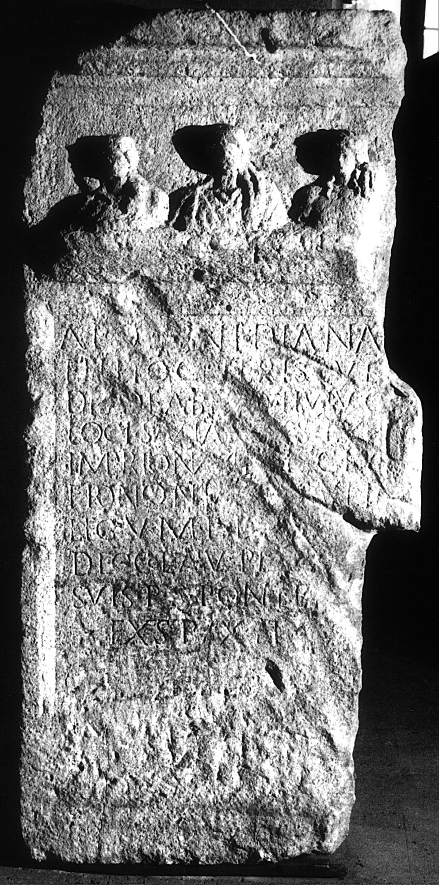
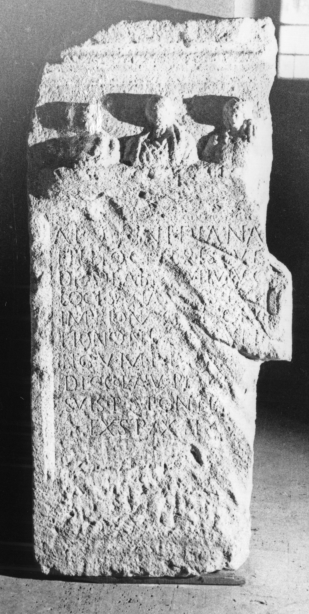

# EDH HD006066. Apulum

**Країна.** Румунія

**Провінція (код EDH).** Dac

**Місце знахідки (антична назва).** Apulum

**Сучасна назва.** Alba Iulia

**Деталі знахідки.** {See Tăuşor}, bei

**Координати.** 46.051849658,23.567755474

**Зберігання.** Alba Iulia, Muz. Unirii

**Датування (роки, від'ємні до н. е.).** 180 … 211

**Матеріал.** Kalkstein

**Тип пам'ятки.** Tafel

**Розміри (висота, ширина, глибина, см).** 122.0 × 58.0 × 26.0

## Текст (латинь, скорочення розкрито)

```
Apol[l]ini Dianae / et Leto(!) ceterisque / dis deab[us]q(ue) huiusq(ue) / loci salutar[ib]us ex / imperio numi[n]is C(aius) Iul(ius) / Frontonia[nu]s vet(eranus) / leg(ionis) V M(acedonicae) p(iae) e[x b(ene)f(iciario) co(n)s(ularis)] / dec(urio) col(oniae) Apul(ensis) pr[o se et] / suis p(ecunia) s(ua) pontem / exstruxit
```

## Текст у вихідному записі

```
APOL[ ]INI DIANAE / ET LETO CETERISQVE / DIS DEAB[ ]Q HVIVSQ / LOCI SALVTAR[ ]VS EX / IMPERIO NVMI[ ]IS C IVL / FRONTONIA[ ]S VET / LEG V M P E[ ] / DEC COL APVL PR[ ] / SVIS P S PONTEM / EXSTRVXIT
```

## Коментар

Bestandteil einer Brücke. Oberhalb der Inschrift die Büsten von Diana, Apoll und Leto..

## Література

AE 1980, 0735.
- I. Piso, ActaMusNapoca 17, 1980, 84-86, Nr. 2; fig. 2 (Foto u. Zeichnung). - AE 1980.
- IDR 3, 5, 036; Foto u. Zeichnung. #

## Фото





Джерело https://edh.ub.uni-heidelberg.de/edh/inschrift/HD006066, ліцензія CC BY-SA 4.0. Оригінальний XML в архіві сирі_дані/edh_xml.zip
