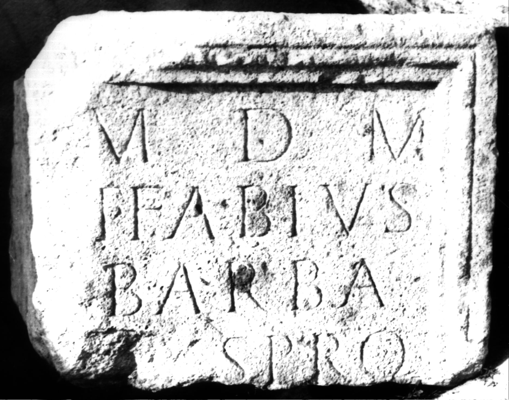
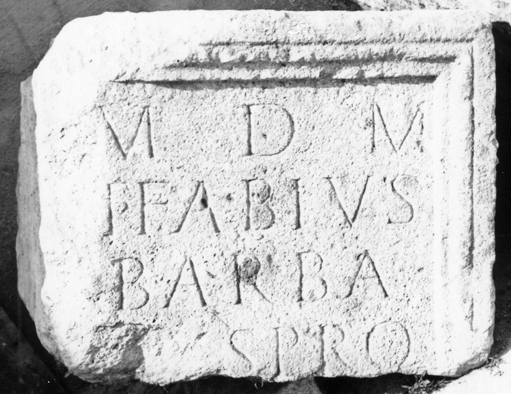

# EDH HD006072. Apulum

**Країна.** Румунія

**Провінція (код EDH).** Dac

**Місце знахідки (антична назва).** Apulum

**Сучасна назва.** Alba Iulia

**Деталі знахідки.** Festung, {S. Michael, katholische Kathedrale}

**Координати.** 46.067648088,23.569900989

**Рік знахідки.** -1977

**Зберігання.** Alba Iulia, katholischer Bischofssitz

**Датування (роки, від'ємні до н. е.).** 107 … 200

**Матеріал.** Kalkstein

**Тип пам'ятки.** Statuenbasis

**Розміри (висота, ширина, глибина, см).** -44.0 × -58.0 × 56.0

## Текст (латинь, скорочення розкрито)

```
M(atri) D(eum) M(agnae) / T(itus) Fabius / Barba/[t?]us pro / [salute? ---] / [&
```

## Текст у вихідному записі

```
M D M / T FABIVS / BARBA / [ ]VS PRO / [ ] / [
```

## Коментар

Fundjahr: zwischen 1968 und 1977. (B): AE 1980; IDR 3, 5: Z. 3/4: Barba/[r]us oder Barba/[t]us; Russu: Z. 3-5: Barba/[r]us pro / [salute sua ---].

## Література

AE 1980, 0737.
- AE 2010, 1377.
- IDR 3, 5, 252; Foto u. Zeichnung.
- I.I. Russu, RevMuz 17, 9, 1980, 34-36, Nr. 1; fig 1 (Foto u. Zeichnung). (B) - AE 1980.
- R. Ardevan, ACD 46, 2010, 126-127; Abb. 3 (Foto u. Zeichnung). - AE 2010. #

## Фото





Джерело https://edh.ub.uni-heidelberg.de/edh/inschrift/HD006072, ліцензія CC BY-SA 4.0. Оригінальний XML в архіві сирі_дані/edh_xml.zip
