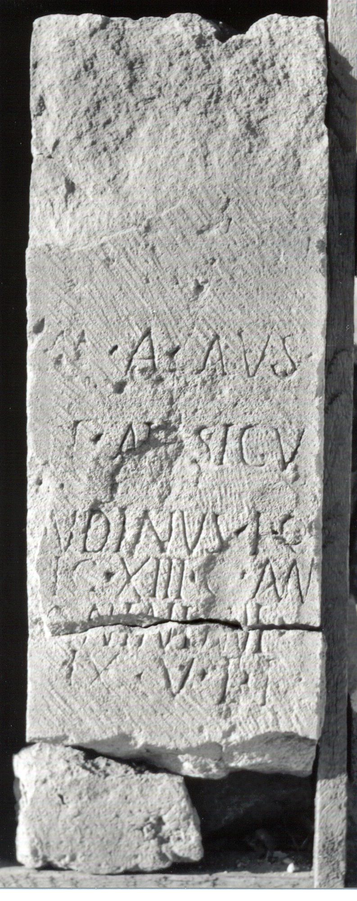
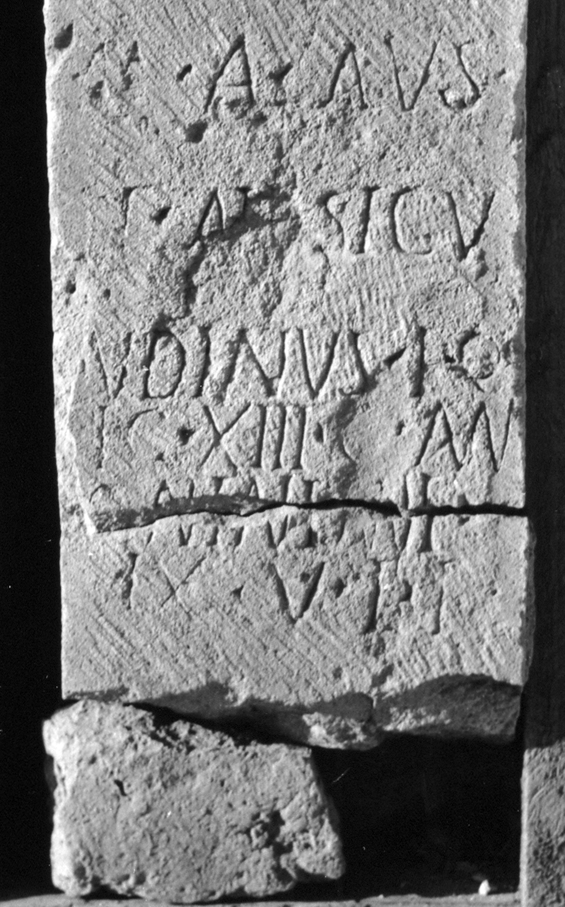

# EDH HD006075. Apulum

**Країна.** Румунія

**Провінція (код EDH).** Dac

**Місце знахідки (антична назва).** Apulum

**Сучасна назва.** Alba Iulia

**Деталі знахідки.** Festung, {S. Michael, katholische Kathedrale}

**Координати.** 46.067648088,23.569900989

**Зберігання.** Alba Iulia, Muz. Unirii

**Датування (роки, від'ємні до н. е.).** 212 … 222

**Матеріал.** Kalkstein

**Тип пам'ятки.** Altar?

**Розміри (висота, ширина, глибина, см).** -75.0 × -25.0 × -28.0

## Текст (латинь, скорочення розкрито)

```
Ma(tribus)(?) Aus(---) / P(ublius) Ael(ius) Secu/ndinus eq(ues) / [l]eg(ionis) XIII g(eminae) An/[t]oninian(a)e / ex v(oto) p(osuit) l(ibenter)
```

## Текст у вихідному записі

```
MA AVS / P AEL SECV / NDINVS EQ / [ ]EG XIII G AN / [ ]ONINIANE / EX V P L
```

## Коментар

Altar oder Statuenbasis. Bekrönung in spätrerer Zeit bearbeitet und als Baustein wiederverwendet.

## Література

AE 1980, 0738.
- I.I. Russu, RevMuz 17, 9, 1980, Nr. 2; fig. 2 (Foto u. Zeichnung). - AE 1980.
- IDR 3, 5, 377; Foto u. Zeichnung. #

## Фото





Джерело https://edh.ub.uni-heidelberg.de/edh/inschrift/HD006075, ліцензія CC BY-SA 4.0. Оригінальний XML в архіві сирі_дані/edh_xml.zip
