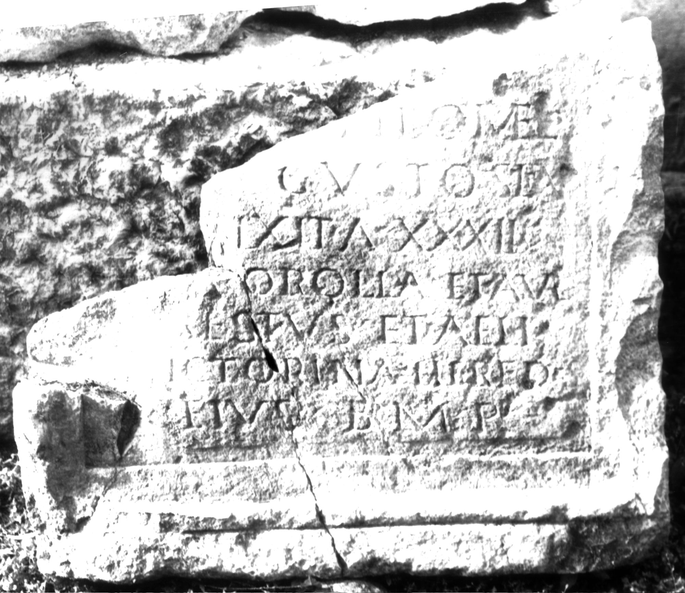

# EDH HD006081. Apulum

**Країна.** Румунія

**Провінція (код EDH).** Dac

**Місце знахідки (антична назва).** Apulum

**Сучасна назва.** Alba Iulia

**Деталі знахідки.** Festung, {S. Michael, katholische Kathedrale}

**Координати.** 46.067648088,23.569900989

**Рік знахідки.** -1977

**Зберігання.** Alba Iulia, Muz. Unirii

**Датування (роки, від'ємні до н. е.).** 171 … 270

**Матеріал.** Kalkstein

**Тип пам'ятки.** Tafel

**Розміри (висота, ширина, глибина, см).** -60.0 × -70.0 × 20.0

## Текст (латинь, скорочення розкрито)

```
[------] / [---] Filomel(us) / [arm(orum)] custos le(gionis) X[I]II / [g(eminae) v]ixit a(nnos) XXXII / [---] Corolla et Aur(elius) / [C(h)]restus et Aelia / [V]ictorina heredes / eius b(ene) m(erenti) p(osuerunt)
```

## Текст у вихідному записі

```
[ ] / [ ] FILOMEL / [ ] CVSTOS LE X[ ]II / [ ]IXIT A XXXII / [ ] COROLLA ET AVR / [ ]RESTVS ET AELIA / [ ]ICTORINA HEREDES / EIVS B M P
```

## Коментар

Zwei aneinanderpassende Fragmente erhalten. Fundjahr: zwischen 1968 und 1977. Hedera am Ende von Z. 4. Z. 3 (Ende): II stehen auf dem Rahmen des Inschriftfeldes. (B): Russu; AE 1980: Abweichungen in Lesung und Ergänzung.

## Література

AE 1987, 0834.
- AE 1980, 0740. (B)
- I. Piso, ActaMusNapoca 22/23, 1985/86, 492-494, Nr. 7; fig. 7a; fig. 7b (Zeichnung). - AE 1987.
- I.I. Russu, RevMuz 17, 9, 1980, 37-38, Nr. 5; fig. 5 (Foto u. Zeichnung). (B) - AE 1980.
- C. Ciongradi, Grabmonument und sozialer Status in Oberdakien (Cluj-Napoca 2007) 272-273, Nr. T/A 3; Taf. 125. (B)
- IDR 3, 5, 529; Foto u. Zeichnung. #

## Фото



Джерело https://edh.ub.uni-heidelberg.de/edh/inschrift/HD006081, ліцензія CC BY-SA 4.0. Оригінальний XML в архіві сирі_дані/edh_xml.zip
