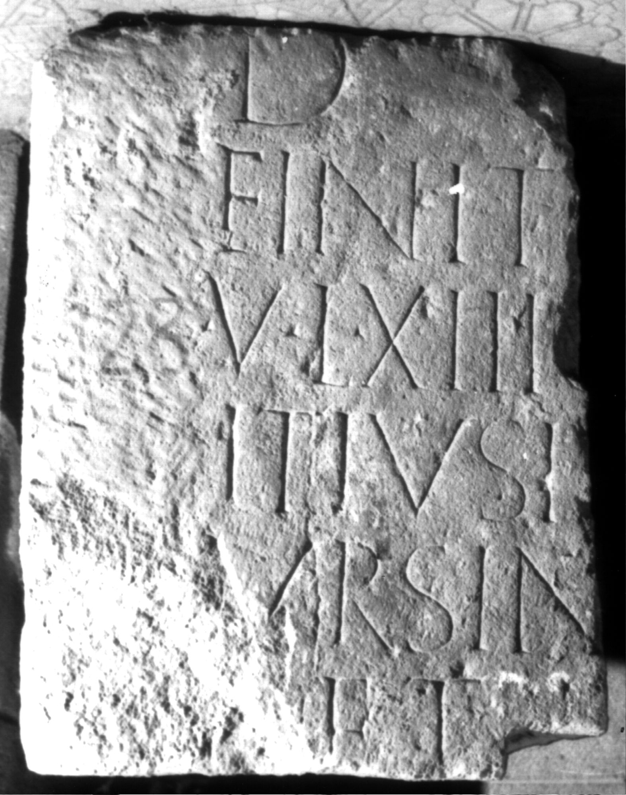

# EDH HD006084. Apulum

**Країна.** Румунія

**Провінція (код EDH).** Dac

**Місце знахідки (антична назва).** Apulum

**Сучасна назва.** Alba Iulia

**Деталі знахідки.** Festung, {S. Michael, katholische Kathedrale}, sekundär verwendet

**Координати.** 46.067648088,23.569900989

**Рік знахідки.** 1968

**Зберігання.** Alba Iulia, Muz. Unirii

**Датування (роки, від'ємні до н. е.).** 151 … 250

**Матеріал.** Kalkstein

**Тип пам'ятки.** Stele?

**Розміри (висота, ширина, глибина, см).** -54.0 × -37.0 × 21.0

## Текст (латинь, скорочення розкрито)

```
D(is) [M(anibus)] / Finit(io) [---] / v(eterano) l(egionis) XIII g[em(inae) Fin]/itius I[--- et?] / Ursin[us? fili(i)] / et h[er(edes)]
```

## Текст у вихідному записі

```
D [ ] / FINIT [ ] / V L XIII G[ ] / ITIVS I[ ] / VRSIN[ ] / ET H[ ]
```

## Коментар

Textwiedergabe nach IDR. Fundjahr: zwischen 1968 und 1977. (B): Russu, AE 1980; Ciongradi:Abweichungen in Lesung und / oder Ergänzung.

## Література

AE 1980, 0741. (B)
- I.I. Russu, RevMuz 17, 9, 1980, 38, Nr. 6; fig. 6 (Foto u. Zeichnung). (B) - AE 1980.
- C. Ciongradi, Grabmonument und sozialer Status in Oberdakien (Cluj-Napoca 2007) 187-188, Nr. S/A 104. (B)
- IDR 3, 5, 530; Foto u. Zeichnung. #

## Фото



Джерело https://edh.ub.uni-heidelberg.de/edh/inschrift/HD006084, ліцензія CC BY-SA 4.0. Оригінальний XML в архіві сирі_дані/edh_xml.zip
