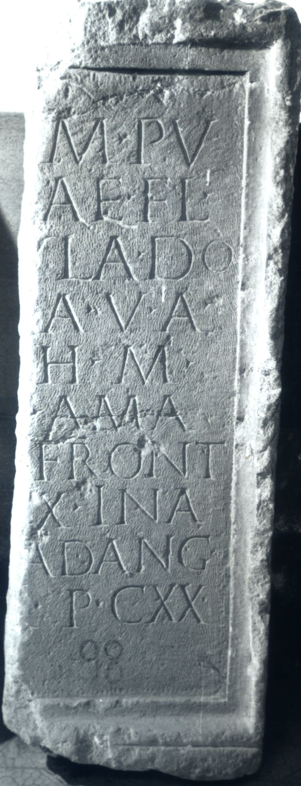

# EDH HD006087. Apulum

**Країна.** Румунія

**Провінція (код EDH).** Dac

**Місце знахідки (антична назва).** Apulum

**Сучасна назва.** Alba Iulia

**Деталі знахідки.** Festung, {S. Michael, katholische Kathedrale}

**Координати.** 46.067648088,23.569900989

**Рік знахідки.** 1979

**Зберігання.** Alba Iulia, Muz. Unirii

**Датування (роки, від'ємні до н. е.).** 107 … 200

**Матеріал.** Kalkstein

**Тип пам'ятки.** Altar?

**Розміри (висота, ширина, глибина, см).** 120.0 × -40.0 × 32.0

## Текст (латинь, скорочення розкрито)

```
[---]M P/[---]AE Fl(avia) / [---]ula do/[mo ---]a v(ixit) a(nnos) L(?) / [---] h(oc) m(onumentum) / [h(eredem) n(on) s(equetur)] a ma/[cer(ia)? in] front(e) / [p(edes) ---]X in a/[gr(o) p(edes) ---] ad ang(ulos) / [---]r(---) p(edes) CXX
```

## Текст у вихідному записі

```
[ ]M P / [ ]AE FL / [ ]VLA DO / [ ]A V A L / [ ] H M / [ ] A MA / [ ] FRONT / [ ]X IN A / [ ] AD ANG / [ ]R P CXX
```

## Коментар

Vorder- und Rückseite sowie die rechte Nebenseite gerahmt (linke Nebenseite nicht erhalten); möglicherweise Fragment vom Mittelteil eines Altars oder Cippus'. Z. 4 (Ende): möglicherweise ein mit A ligiertes L. (B): AE 1980: Z. 7: [---] in; Z. 9: p(edes) ad.

## Література

AE 1980, 0742. (B)
- I.I. Russu, RevMuz 17, 9, 1980, Nr. 7; fig. 7 (Foto u. Zeichnung). - AE 1980.
- C. Ciongradi, Grabmonument und sozialer Status in Oberdakien (Cluj-Napoca 2007) 230, Nr. Sc/A 2;Taf. 90.
- IDR 3, 5, 565; Foto. #

## Фото



Джерело https://edh.ub.uni-heidelberg.de/edh/inschrift/HD006087, ліцензія CC BY-SA 4.0. Оригінальний XML в архіві сирі_дані/edh_xml.zip
