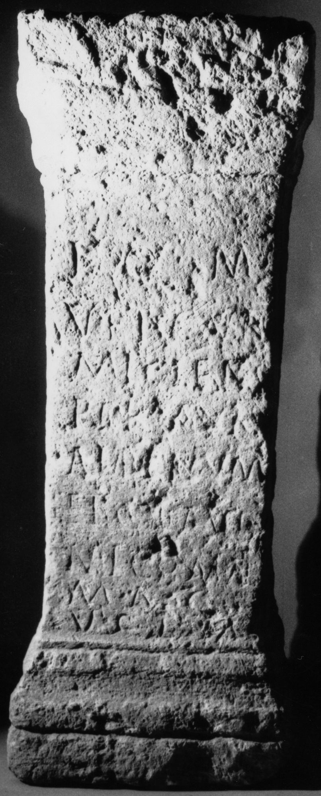

# EDH HD006303. Micia

**Країна.** Румунія

**Провінція (код EDH).** Dac

**Місце знахідки (антична назва).** Micia

**Сучасна назва.** Veţel

**Деталі знахідки.** {Micia}

**Координати.** 45.914556455,22.816629409

**Рік знахідки.** 1913

**Зберігання.** Deva, Muz. Civil. Dac. şi Rom.

**Датування (роки, від'ємні до н. е.).** 107 … 200

**Тип пам'ятки.** Altar

**Розміри (висота, ширина, глибина, см).** 109.0 × 32.0 × 32.0

## Текст (латинь, скорочення розкрито)

```
I(ovi) O(ptimo) M(aximo) / v(eterani) et c(i)v(es) R(omani) / Miciens(es) / per Aur(elium) / Alpinum / et Claud(ium) / Nicomae(dem)(!) / mag(istros) / v(otum) s(olverunt) l(ibentes) m(erito)
```

## Текст у вихідному записі

```
I O M / V ET CV R / MICIENS / PER AVR / ALPINVM / ET CLAVD / NICOMAE / MAG / V S L M
```

## Коментар

(B): Z. 2: Daicoviciu 1930/31, AE 1931, AE 1933: vet(eranorum) cur(ia); Z. 6/7: AE 1980: Claud(ium) Nicomae(dem).

## Література

AE 1980, 0779. (B)
- AE 1931, 0121. (B)
- AE 1933, 0011. (B)
- IDR 3, 3, 081; fig. 65 (Foto u. Zeichnung).
- I.I. Russu, StCercIstorV 31, 1980, 448, Nr. 1; fig. 1 (Zeichnung). - AE 1980.
- C. Daicoviciu, ACM 3, 1930/31, 40, Nr. 12. (B) - AE 1931. 1933. #

## Фото



Джерело https://edh.ub.uni-heidelberg.de/edh/inschrift/HD006303, ліцензія CC BY-SA 4.0. Оригінальний XML в архіві сирі_дані/edh_xml.zip
