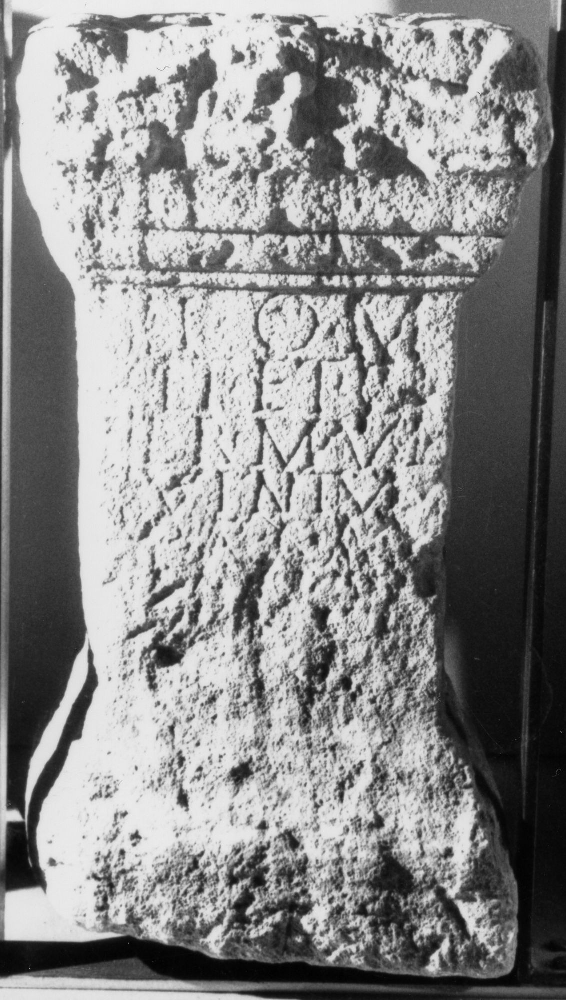

# EDH HD006312. Micia

**Країна.** Румунія

**Провінція (код EDH).** Dac

**Місце знахідки (антична назва).** Micia

**Сучасна назва.** Veţel

**Деталі знахідки.** Mintia, {Schloss Gyulai Ferencz}, Park

**Координати.** 45.924930969,22.856562137

**Зберігання.** Deva, Muz. Civil. Dac. şi Rom.

**Датування (роки, від'ємні до н. е.).** 107 … 200

**Розміри (висота, ширина, глибина, см).** -70.0 × -26.0 × -25.0

## Текст (латинь, скорочення розкрито)

```
I(ovi) O(ptimo) M(aximo) / vet(erani) et c(ives) [R(omani)] / [pe]r M(arcum) Ul[p(ium)] / [Q]uintum / [mag(istrum) ---]
```

## Текст у вихідному записі

```
I O M / VET ET C [ ] / [ ]R M VL[ ] / [ ]VINTVM / [ ]
```

## Коментар

(B): CIL, Russu, AE 1980, IDR: geringfügig abweichende Textwiedergaben.

## Література

AE 1980, 0782. (B)
- I.I. Russu, StCercIstorV 31, 1980, 448, Nr. 4; fig. 4 (Zeichnung). (B) - AE 1980.
- CIL 03, 01352. (B)
- IDR 3, 3, 083; fig. 67 (Foto u. Zeichnung). (B) #

## Фото



Джерело https://edh.ub.uni-heidelberg.de/edh/inschrift/HD006312, ліцензія CC BY-SA 4.0. Оригінальний XML в архіві сирі_дані/edh_xml.zip
