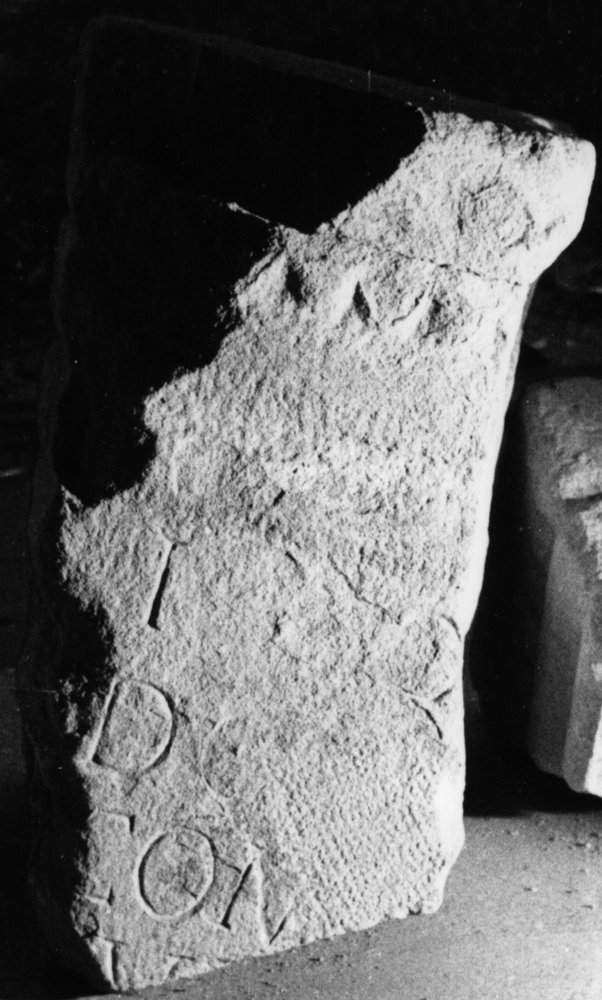

# EDH HD007242. Avrig

**Країна.** Румунія

**Провінція (код EDH).** Dac

**Сучасна назва.** Avrig

**Деталі знахідки.** Săcădate, {lutheranische Kirche}

**Координати.** 45.759203732,24.389128088

**Зберігання.** Sibiu, Muz. Brukenthal

**Датування (роки, від'ємні до н. е.).** 101 … 250

**Тип пам'ятки.** Altar

**Розміри (висота, ширина, глибина, см).** -40.0 × -55.0 × -25.0

## Текст (латинь, скорочення розкрито)

```
I(ovi) O(ptimo) M(aximo) / Dolic(h)[eno] / Comm[ageno]/[r]um [&
```

## Текст у вихідному записі

```
I O M / DOLIC[ ] / COMM[ ] / [ ]VM [
```

## Коментар

Drei aneinander passende Fragmente erhalten. Textwiedergabe nach Foto u. Zeichnung in IDR. (B): IDR, AE 1888, CCID: abweichende Lesungen / Ergänzungen.

## Література

AE 1988, 0962. (B)
- IDR 3, 4, 086; fig. 45 (Foto u. Zeichnung). (B)
- CCID 162. (B) #

## Фото



Джерело https://edh.ub.uni-heidelberg.de/edh/inschrift/HD007242, ліцензія CC BY-SA 4.0. Оригінальний XML в архіві сирі_дані/edh_xml.zip
