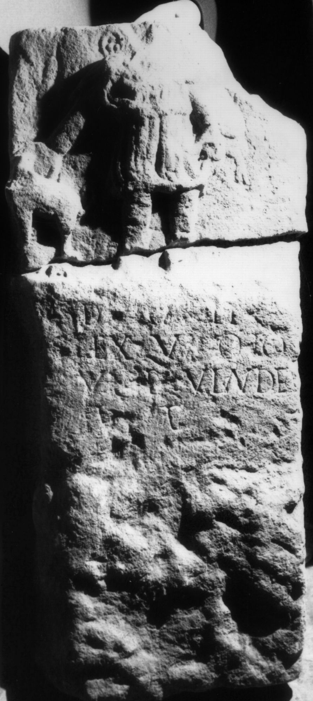
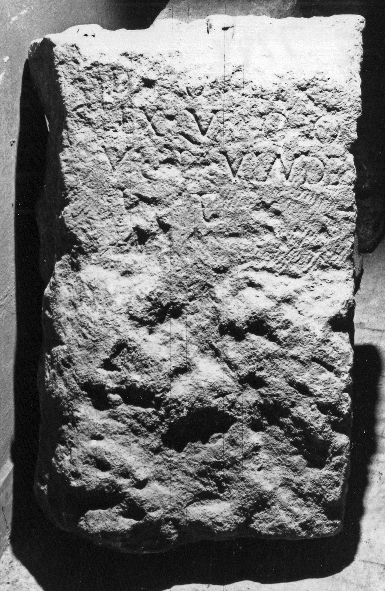

# EDH HD007294. Cricău

**Країна.** Румунія

**Провінція (код EDH).** Dac

**Сучасна назва.** Cricău

**Деталі знахідки.** {Tibru}, südlich, "Rât"

**Координати.** 46.1967,23.564100000

**Рік знахідки.** 1877

**Зберігання.** Alba Iulia, Muz. Unirii

**Датування (роки, від'ємні до н. е.).** 101 … 200

**Тип пам'ятки.** Relief

**Розміри (висота, ширина, глибина, см).** -150.0 × -40.0 × 15.0

## Текст (латинь, скорочення розкрито)

```
D[i]anae / ex voto / Ulp(ius) Vindex / [v(otum)] p(osuit) l(ibens)
```

## Текст у вихідному записі

```
D[ ]ANAE / EX VOTO / VLP VINDEX / [ ] P L
```

## Література

IDR 3, 4, 055; fig. 28 (Fotos u. Zeichnung).
- CIL 03, 07744.
- IDR 3, 5, 009*. #

## Фото





Джерело https://edh.ub.uni-heidelberg.de/edh/inschrift/HD007294, ліцензія CC BY-SA 4.0. Оригінальний XML в архіві сирі_дані/edh_xml.zip
