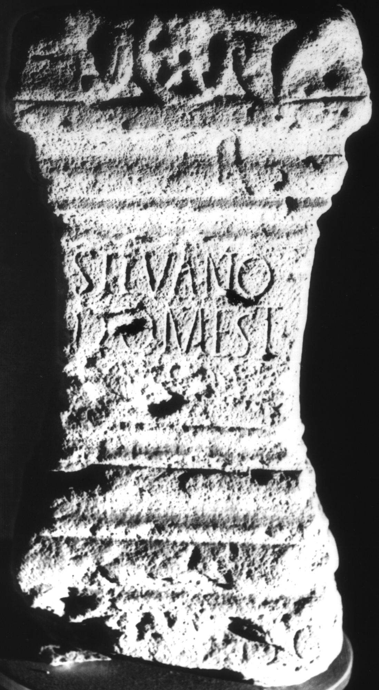

# EDH HD008064. Apulum

**Країна.** Румунія

**Провінція (код EDH).** Dac

**Місце знахідки (антична назва).** Apulum

**Сучасна назва.** Alba Iulia

**Координати.** 46.0669444,23.569999999

**Зберігання.** Alba Iulia, Muz. Unirii

**Датування (роки, від'ємні до н. е.).** 201 … 270

**Матеріал.** Kalkstein

**Тип пам'ятки.** Altar

**Розміри (висота, ширина, глибина, см).** 40.0 × 20.0 × 17.0

## Текст (латинь, скорочення розкрито)

```
Silvano / Domest(ico) / [[[------]]] // [e]x viso
```

## Текст у вихідному записі

```
SILVANO / DOMEST / [[[ ]]] / / [ ]X VISO
```

## Коментар

Auf der linken Nebenseite ein Adler(?), auf der rechten Nebenseite eine nicht mehr identifizierbare Reliefdarstellung. Zeilenlinien für die Beschriftung; Z. 4 steht auf der crepido. (B): Băluţă; AE 1986f: Z. 4: ex.

## Література

AE 1986, 0608. (B)
- C.L. Băluţă, Apulum 23, 1986, 121-122, Nr. 3; fig. 3 (Foto u. Zeichnung). (B) - AE 1986.
- IDR 3, 5, 333; Foto u. Zeichnung. #

## Фото



Джерело https://edh.ub.uni-heidelberg.de/edh/inschrift/HD008064, ліцензія CC BY-SA 4.0. Оригінальний XML в архіві сирі_дані/edh_xml.zip
