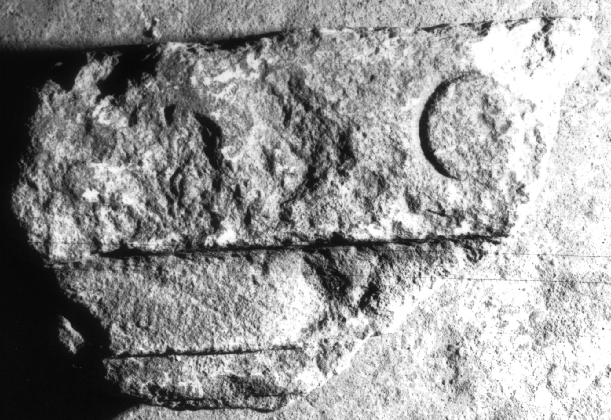

# EDH HD008076. Apulum

**Країна.** Румунія

**Провінція (код EDH).** Dac

**Місце знахідки (антична назва).** Apulum

**Сучасна назва.** Alba Iulia

**Координати.** 46.0669444,23.569999999

**Зберігання.** Alba Iulia, Muz. Unirii

**Датування (роки, від'ємні до н. е.).** 107 … 200

**Матеріал.** Kalkstein

**Тип пам'ятки.** Altar?

**Розміри (висота, ширина, глибина, см).** -17.0 × -26.0 × -10.0

## Текст (латинь, скорочення розкрито)

```
I(ovi) O(ptimo) [M(aximo)] // [&
```

## Текст у вихідному записі

```
I O [ ] / / [
```

## Коментар

Fragment eines Altars oder einer Statuenbasis; Z. 1 auf der corona.

## Література

AE 1986, 0612.
- IDR 3, 5, 120, Foto u. Zeichnung.
- C.L. Băluţă, Apulum 23, 1986, 126, Nr. 9; fig. 9 (Foto u. Zeichnung). - AE 1986. #

## Фото



Джерело https://edh.ub.uni-heidelberg.de/edh/inschrift/HD008076, ліцензія CC BY-SA 4.0. Оригінальний XML в архіві сирі_дані/edh_xml.zip
