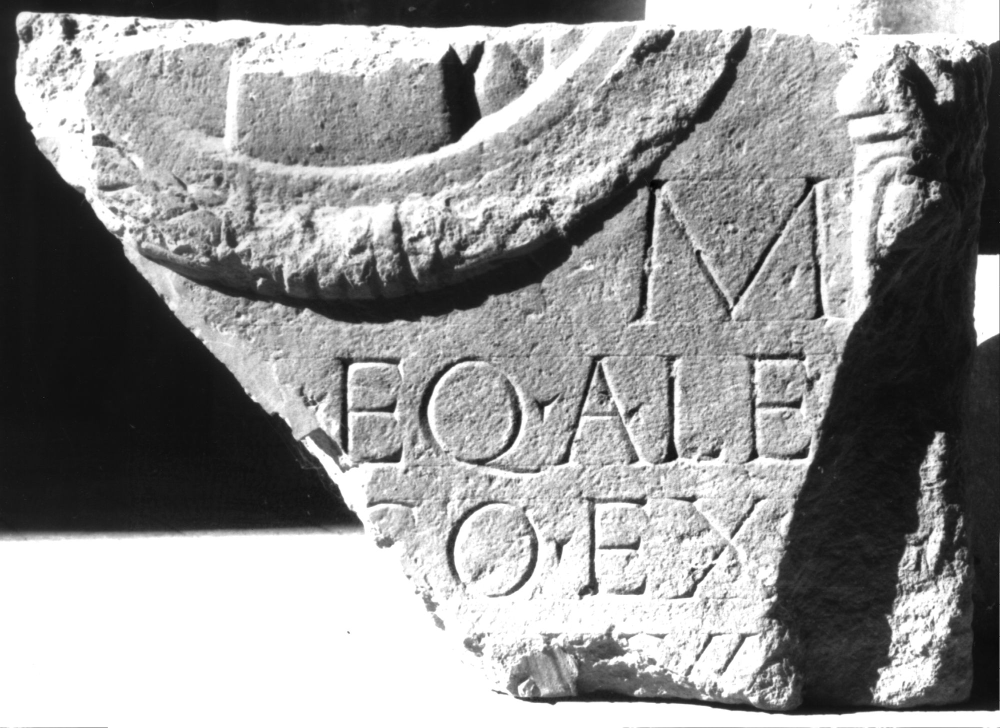
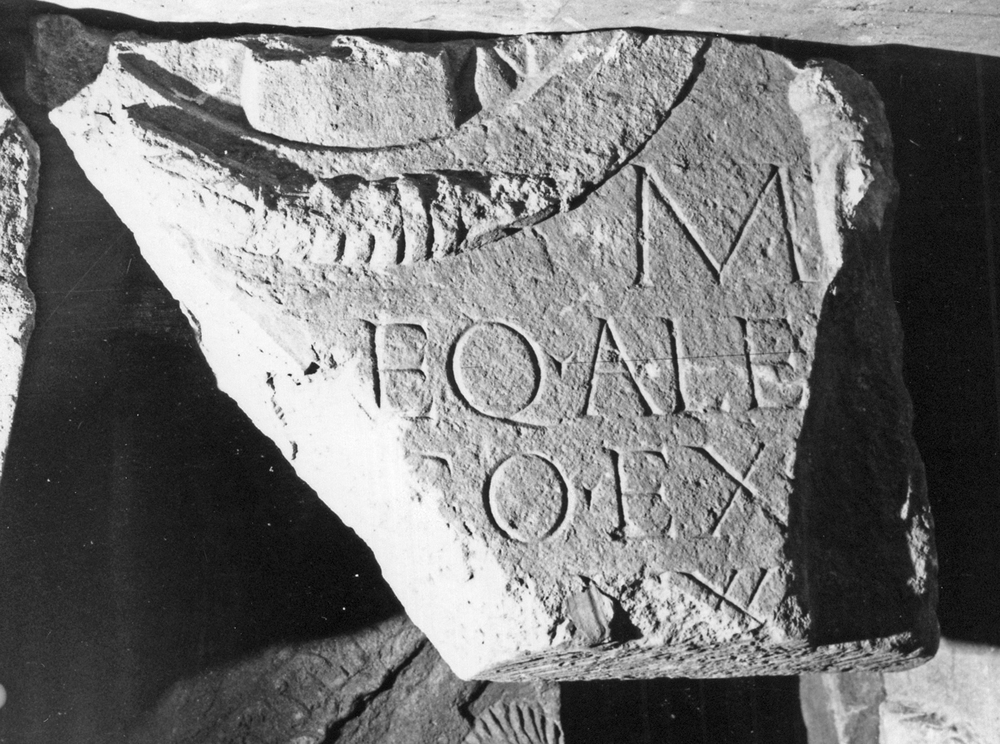

# EDH HD009332. Apulum

**Країна.** Румунія

**Провінція (код EDH).** Dac

**Місце знахідки (антична назва).** Apulum

**Сучасна назва.** Alba Iulia

**Координати.** 46.0669444,23.569999999

**Зберігання.** Alba Iulia, Muz. Unirii

**Датування (роки, від'ємні до н. е.).** 138 … 200

**Матеріал.** Kalkstein

**Тип пам'ятки.** Stele

**Розміри (висота, ширина, глибина, см).** -51.0 × -73.0 × 18.0

## Текст (латинь, скорочення розкрито)

```
[D(is)] M(anibus) / [---] eq(ues) al(a)e / [Illyri?]co(rum) ex / [n(umero)? sing(ularium)? v(ixit)?] an(nos) XXX[-?] / [&
```

## Текст у вихідному записі

```
[ ] M / [ ] EQ ALE / [ ]CO EX / [ ] AN XXX[ ] / [
```

## Коментар

Oberhalb der Inschrift und in Z. 1 hineinragend unterer Teil eines Medaillons mit ehemals drei oder vier Büsten erhalten. (B): Ciongradi: Z. 4: a(nnis).

## Література

AE 1988, 0947.
- I.I. Russu, StCercIstorV 18, 1967, 174-176, Nr. 8; fig. 8 (Zeichnung). - AE 1988.
- C. Ciongradi, Grabmonument und sozialer Status in Oberdakien (Cluj-Napoca 2007) 168-169, Nr. S/A 29; Taf. 46. (B)
- IDR 3, 5, 631; Foto u. Zeichnung. #

## Фото





Джерело https://edh.ub.uni-heidelberg.de/edh/inschrift/HD009332, ліцензія CC BY-SA 4.0. Оригінальний XML в архіві сирі_дані/edh_xml.zip
