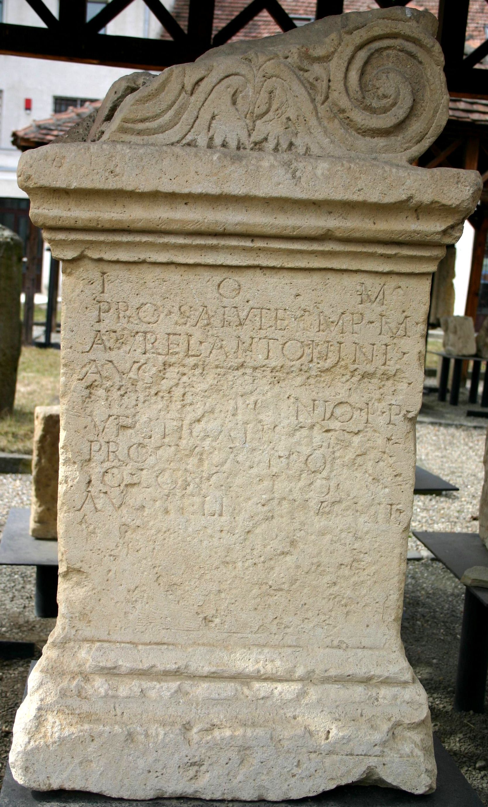
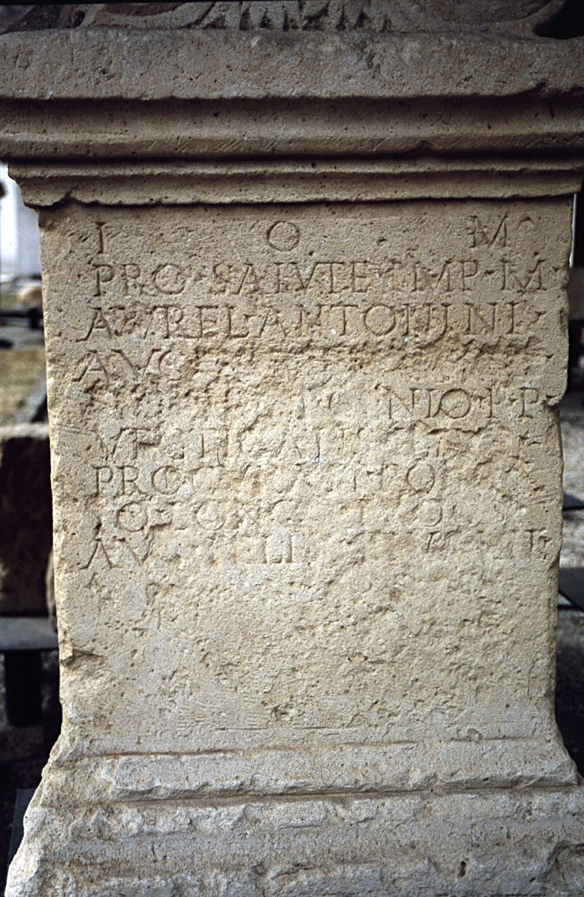
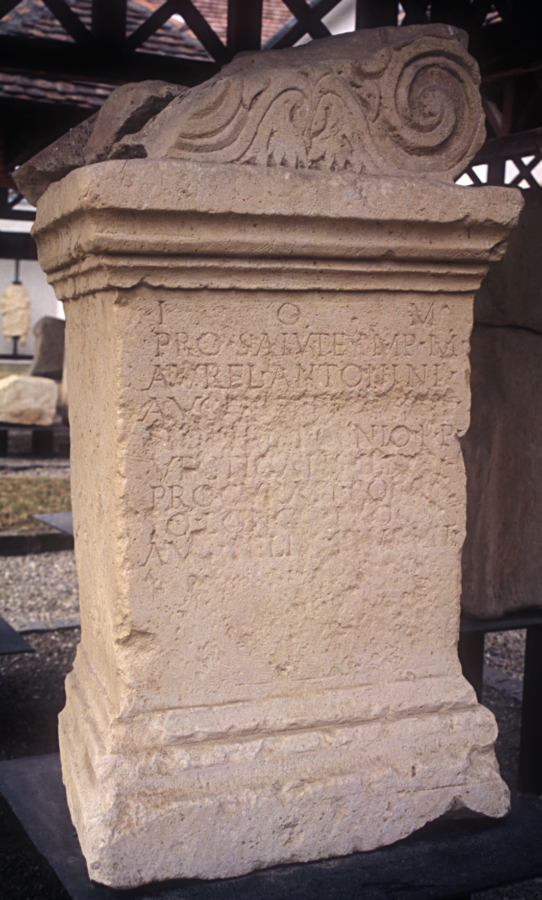

# EDH HD009425. Porolissum

**Країна.** Румунія

**Провінція (код EDH).** Dac

**Місце знахідки (антична назва).** Porolissum

**Сучасна назва.** Mirşid

**Деталі знахідки.** Moigrad, {statio portorii}

**Координати.** 47.183937653,23.153890368

**Рік знахідки.** -1987

**Зберігання.** Zalău, Muz. Ist. Artă

**Датування (роки, від'ємні до н. е.).** 175 … 177

**Тип пам'ятки.** Altar?

**Розміри (висота, ширина, глибина, см).** 129.0 × 60.0 × 71.0

## Текст (латинь, скорочення розкрито)

```
I(ovi) O(ptimo) M(aximo) / pro salute Imp(eratoris) M(arci) / Aurel(i) Antonini / Aug(usti) [[[et Commod]i]] / [[[Caes(aris)]]] et Genio p(ublici) p(ortorii) / vectigalis Illyr(ici) / procurante Pompe/io Longo proc(uratore) / Aug(usti) Felix eius vil(icus)
```

## Текст у вихідному записі

```
I O M / PRO SALVTE IMP M / AVREL ANTONINI / AVG [[[ ]I]] / [[[ ]]] ET GENIO P P / VECTIGALIS ILLYR / PROCVRANTE POMPE / IO LONGO PROC / AVG FELIX EIVS VIL
```

## Коментар

Textwiedergabe/Ergänzungen nach Piso. (B): Gudea 1988, AE 1988, Gudea 1996, ILD 678: Z. 5: [[Pii Fel(icis)]]. Altar oder Statuenbasis.

## Література

AE 1988, 0978. (B)
- N. Gudea, ActaMusPorol 12, 1988, 178-181, Nr. 3; fig. 7 (Zeichnung). (B) - AE 1988.
- AE 1996, 1274.
- ILD 678. (B)
- AE 1993, 1326.
- N. Gudea, Porolissum 2. Un complex archeologic daco-roman la marginea de nord a Imperiului Roman (Cluj-Napoca 1996) 277-278, Nr. 1. (B) - AE 1996.
- J. Fitz, in: H. Swozilek - G. Grabher (Hrsg.), Archäologie in Gebirgen. Elmar Vonbank zum 70. Geburtstag (Bregenz 1992) 201. - AE 1993.
- AE 2005, 1289.
- I. Piso, ActaMusNapoca 41/42, 2004/05, 183-185, Nr. 1; fig. 1. - AE 2005. #

## Фото







Джерело https://edh.ub.uni-heidelberg.de/edh/inschrift/HD009425, ліцензія CC BY-SA 4.0. Оригінальний XML в архіві сирі_дані/edh_xml.zip
