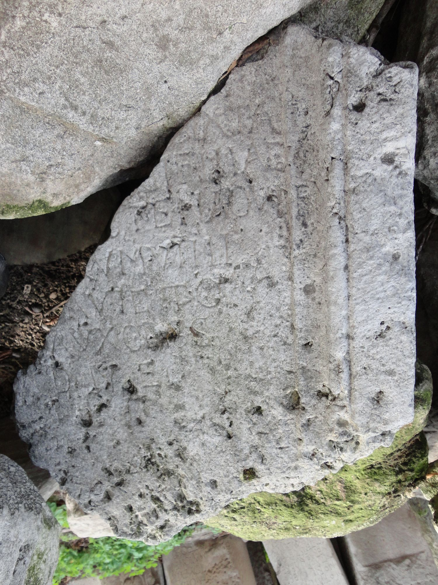
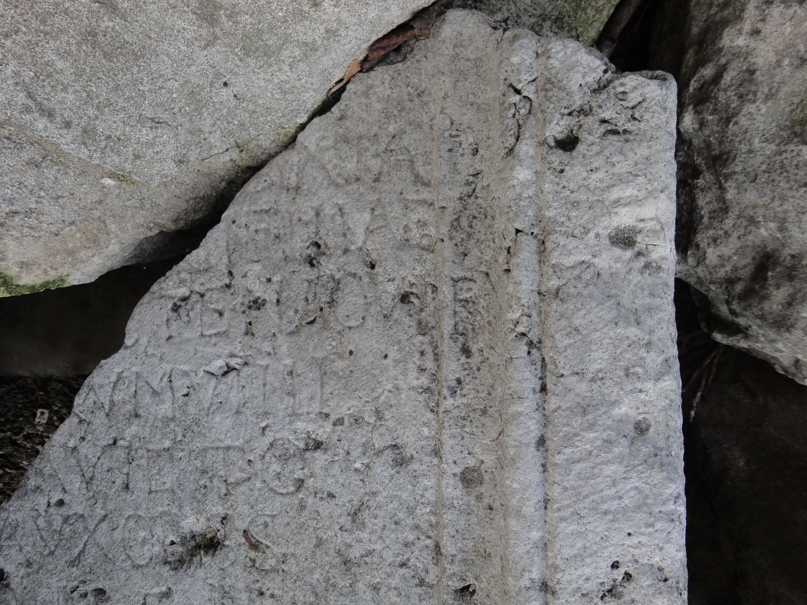
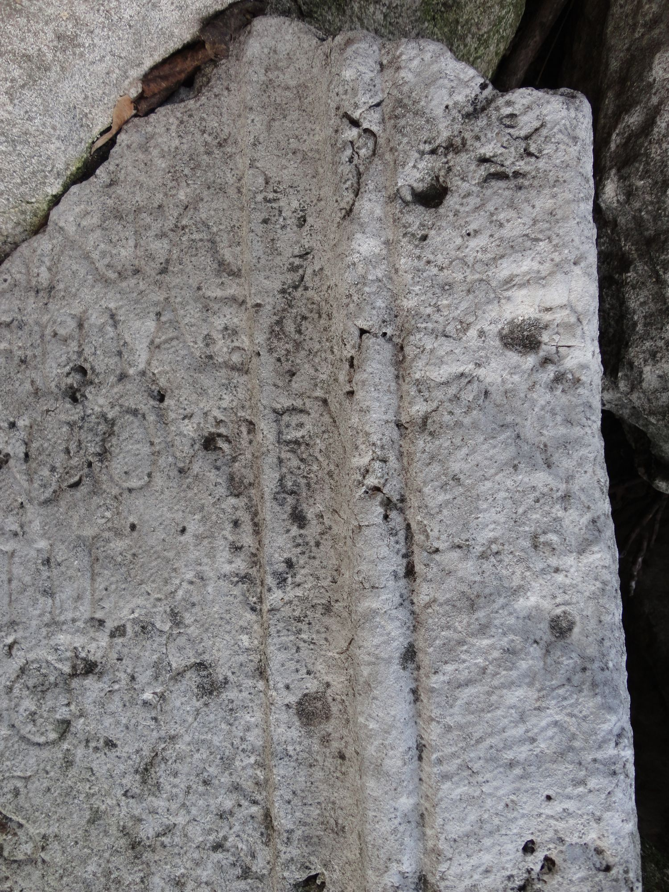
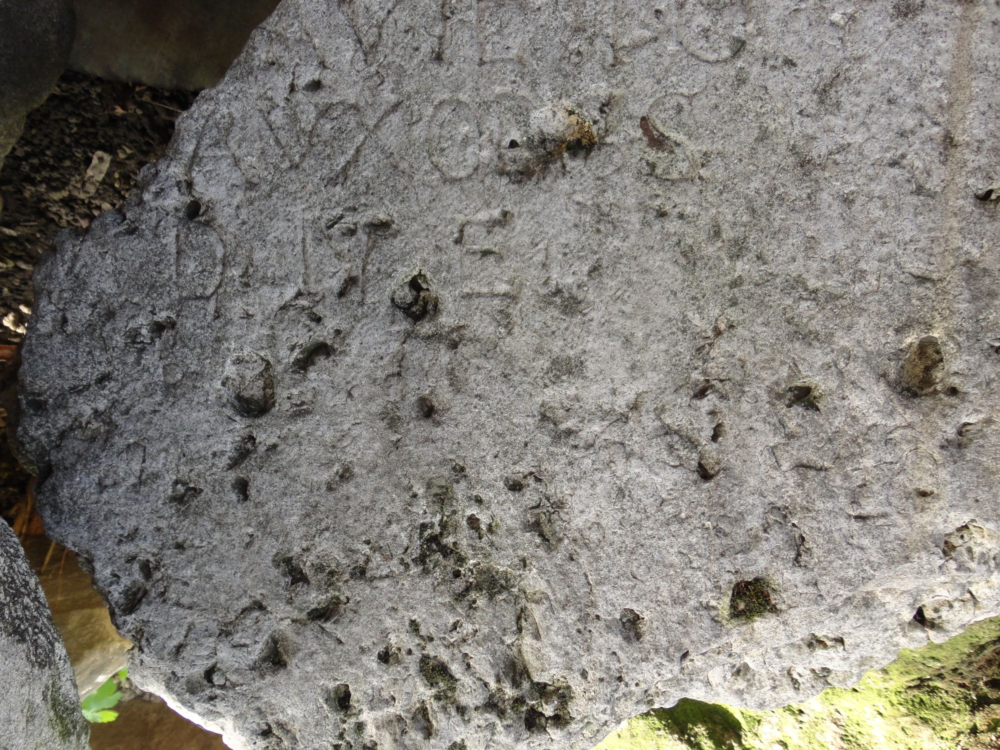
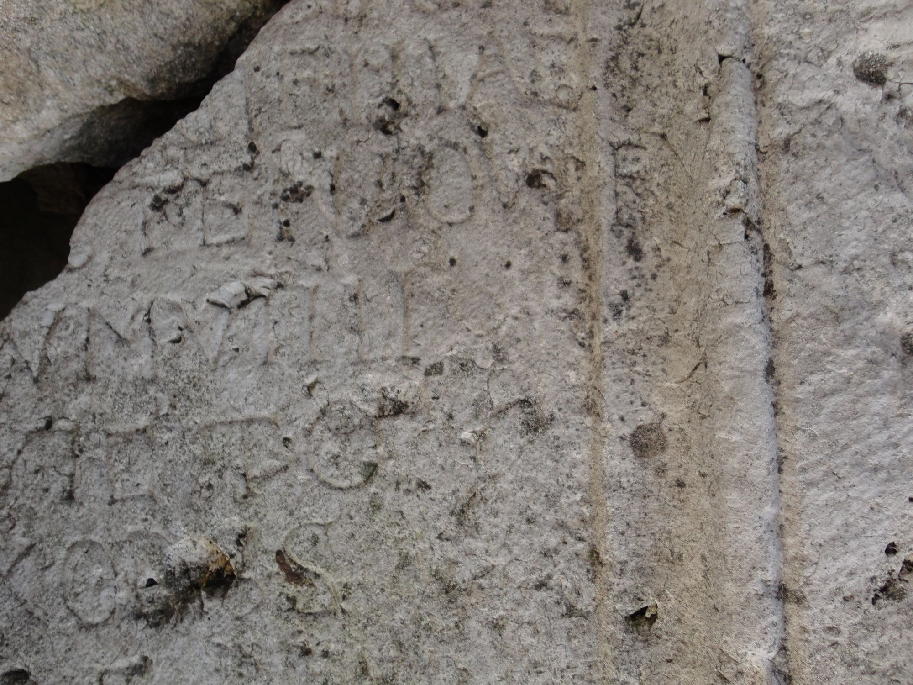

# EDH HD009485. Tomi

**Країна.** Румунія

**Провінція (код EDH).** MoI

**Місце знахідки (антична назва).** Tomi

**Сучасна назва.** Constanţa

**Координати.** 44.1763912,28.623864099

**Рік знахідки.** -1900

**Зберігання.** Bucureşti, Muz. Naţ. Ist. Rom.

**Датування (роки, від'ємні до н. е.).** 151 … 200

**Матеріал.** Kalkstein

**Тип пам'ятки.** Tafel

**Розміри (висота, ширина, глибина, см).** -74.0 × -66.0 × 18.0

## Текст (латинь, скорочення розкрито)

```
$] / [---]I(?) / [---] Sixta(!) / [--- Victo?]rii filiae / [---]stena Ovi f(ilia) v/[ixit an(n)o]rum VIIII / [---]a Victo/[rian?]a uxor s(upra) s(criptis) / <b=D>(ene)(?)#<b>(ene)(?)#D <m=N>(erentibus)#<m>(erentibus)#N <f=E>(ecit)(?)#<f>(ecit)(?)#E
```

## Текст у вихідному записі

```
] / [ ]I / [ ] SIXTA / [ ]RII FILIAE / [ ]STENA OVI F V / [ ]RVM VIIII / [ ]A VICTO / [ ]A VXOR S S / D N E
```

## Коментар

Z. 1: von I(?) ist nur der untere Teil erhalten. Z. 4 (Ende): Die Buchstaben F V befinden sich auf dem Profil des Rahmens. Neulesung und Ergänzungsvorschläge nach H. Hofmann. Z. 8 nach Vorschlag B. Gräf (Appendix in Hofmann, GIF 69, 2017, 222-223). (B): Tudor; AE 1988; IScM: Abweichungen in Lesung und Ergänzung.

## Література

AE 1988, 1001. (B)
- IScM 2, 220; Zeichnung. (B)
- D. Tudor, MatCercA 2, 1956, 585-587, Nr. 56; fig. 13 (Zeichnung). (B) - AE 1988.
- H. Hofmann, GIF 69, 2017, 199-226; Fig. 1 u. 2; Fig. 3 (Zeichnung); Zeichnung. #

## Фото











Джерело https://edh.ub.uni-heidelberg.de/edh/inschrift/HD009485, ліцензія CC BY-SA 4.0. Оригінальний XML в архіві сирі_дані/edh_xml.zip
