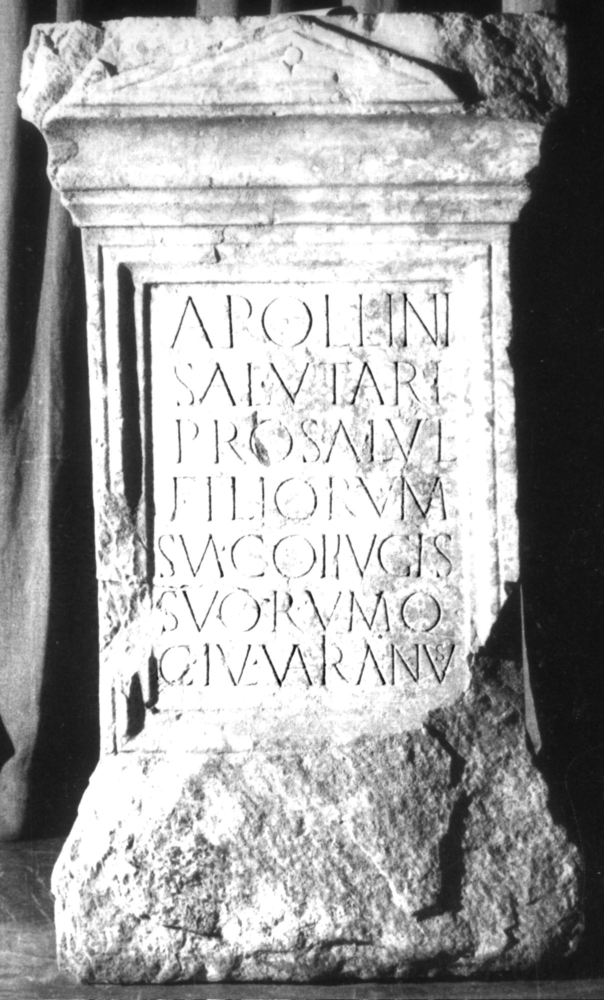

# EDH HD009694. Apulum

**Країна.** Румунія

**Провінція (код EDH).** Dac

**Місце знахідки (антична назва).** Apulum

**Сучасна назва.** Alba Iulia

**Деталі знахідки.** {Partoş}

**Координати.** 46.0463184,23.566650100

**Зберігання.** Alba Iulia, Muz. Unirii

**Датування (роки, від'ємні до н. е.).** 151 … 200

**Матеріал.** Marmor

**Тип пам'ятки.** Altar

**Розміри (висота, ширина, глибина, см).** 106.0 × 40.0 × 22.5

## Текст (латинь, скорочення розкрито)

```
Apollini / Salutari / pro salute / filiorum / sua coi{i}ugis / suorumq(ue) / C(aius) Iul(ius) Varianus
```

## Текст у вихідному записі

```
APOLLINI / SALVTARI / PRO SALVTE / FILIORVM / SVA COIIVGIS / SVORVMQ / C IVL VARIANVS
```

## Література

AE 1972, 0456. (B)
- I. Berciu - C.L. Băluţă, Latomus 31, 1972, 1047-1052; fig. 1; fig. 2 (Zeichnung). (B) - AE 1972.
- IDR 3, 5, 034; Foto. #

## Фото



Джерело https://edh.ub.uni-heidelberg.de/edh/inschrift/HD009694, ліцензія CC BY-SA 4.0. Оригінальний XML в архіві сирі_дані/edh_xml.zip
