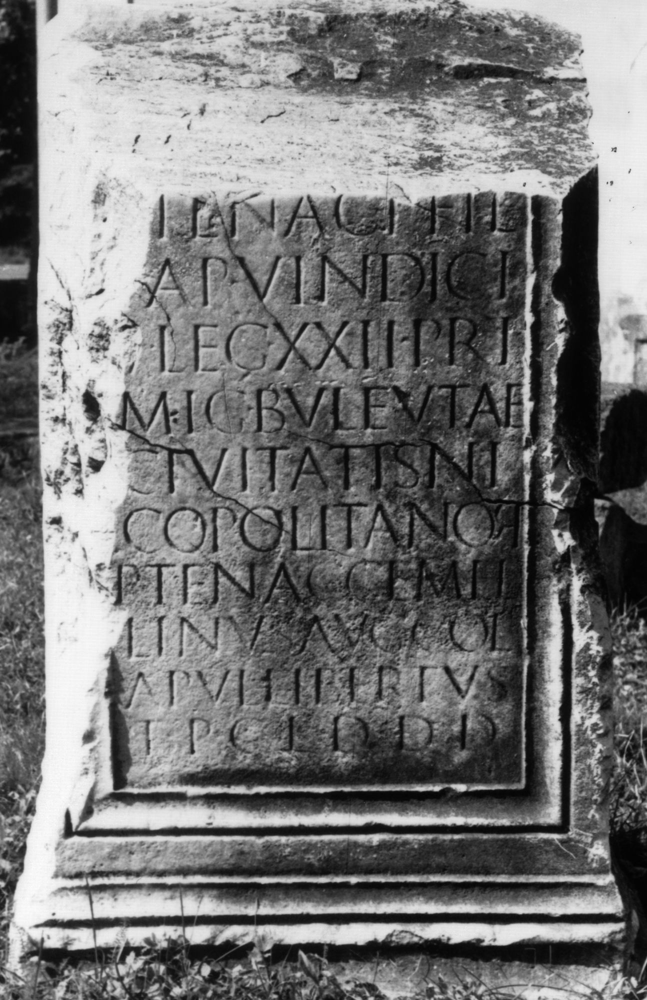

# EDH HD009712. Apulum

**Країна.** Румунія

**Провінція (код EDH).** Dac

**Місце знахідки (антична назва).** Apulum

**Сучасна назва.** Alba Iulia

**Деталі знахідки.** Mureş, Flußufer

**Координати.** 46.0669444,23.569999999

**Зберігання.** Deva, Muz. Civil. Dac. şi Rom.

**Датування (роки, від'ємні до н. е.).** 180 … 230

**Матеріал.** Marmor

**Тип пам'ятки.** Statuenbasis

**Розміри (висота, ширина, глибина, см).** -125.0 × -96.0 × 70.0

## Текст (латинь, скорочення розкрито)

```
[P(ublio)] Tenac(io) P(ubli) fil(io) / [P]ap(iria) Vindici / |(centurioni) leg(ionis) XXII Pri/mig(eniae) buleutae / civitatis Ni/copolitanor(um) / P(ublius) Tenac(ius) Gemel/linus Aug(ustalis) col(oniae) / Apul(ensis) libertus / t(estamentum) p(onendum) c(uravit) l(ocus) d(atus) d(ecreto) d(ecurionum)
```

## Текст у вихідному записі

```
[ ] TENAC P FIL / [ ]AP VINDICI / | LEG XXII PRI / MIG BVLEVTAE / CIVITATIS NI / COPOLITANOR / P TENAC GEMEL / LINVS AVG COL / APVL LIBERTVS / T P C L D D D
```

## Коментар

Bekrönung der Basis nicht erhalten. Russu; AE 1972: Z. 10: t(itulum). Nach IDR III 5 wird die Basis in IDR III 2 zu Unrecht zu Sarmizegetusa gerechnet. Datierung: nicht vor der Regierungszeit des Commodus, als Apulum colonia wurde.

## Література

AE 1972, 0467.
- I.I. Russu, ActaMusNapoca 3, 1966, 453-456, Nr. 2; fig. 2 (Zeichnung). - AE 1972.
- IDR 3, 2, 120; fig. 95 (Foto u. Zeichnung) IDR 3, 5, 582; Foto.
- CIL 03, 01481.
- CIL 03, 01481 add. p. 1016.
- CIL 03, 01481 add. p. 1407.
- R. Ardevan, Novensia 15, 2004, 99-105. - AE 2004.
- AE 2004, 1197. #

## Фото



Джерело https://edh.ub.uni-heidelberg.de/edh/inschrift/HD009712, ліцензія CC BY-SA 4.0. Оригінальний XML в архіві сирі_дані/edh_xml.zip
