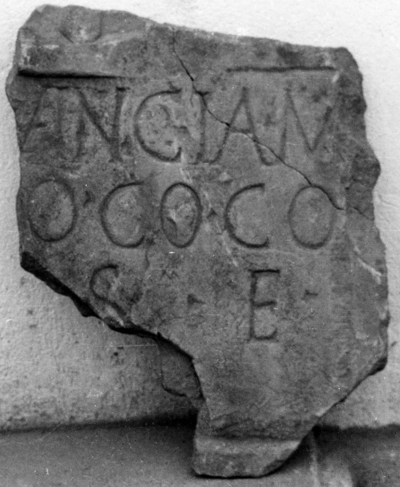

# EDH HD009751. Târnăveni

**Країна.** Румунія

**Провінція (код EDH).** Dac

**Сучасна назва.** Târnăveni

**Деталі знахідки.** {Botorca}

**Координати.** 46.2823,24.301600000

**Рік знахідки.** 1962

**Зберігання.** Târnăveni, Muzeul

**Датування (роки, від'ємні до н. е.).** 101 … 150

**Матеріал.** Gesteine

**Тип пам'ятки.** Tafel

**Розміри (висота, ширина, глибина, см).** -39.5 × -31.0

## Текст (латинь, скорочення розкрито)

```
[D(is)] M(anibus) // [--- La?]vincia / [an(norum)? ---]o co(niugi) co/[mpari p(osuit) h(ic)] s(ita) e(st)
```

## Текст у вихідному записі

```
[ ] M / / [ ]VINCIA / [ ]O CO CO / [ ] S E
```

## Література

AE 1972, 0482.
- I. Piso - V. Pepela, ActaMusNapoca 9, 1972, 473-474, Nr. 1; fig. 1; fig. 2 (Zeichnung). - AE 1972.
- IDR 3, 4, 128; fig. 58 (Foto u. Zeichnung). #

## Фото



Джерело https://edh.ub.uni-heidelberg.de/edh/inschrift/HD009751, ліцензія CC BY-SA 4.0. Оригінальний XML в архіві сирі_дані/edh_xml.zip
