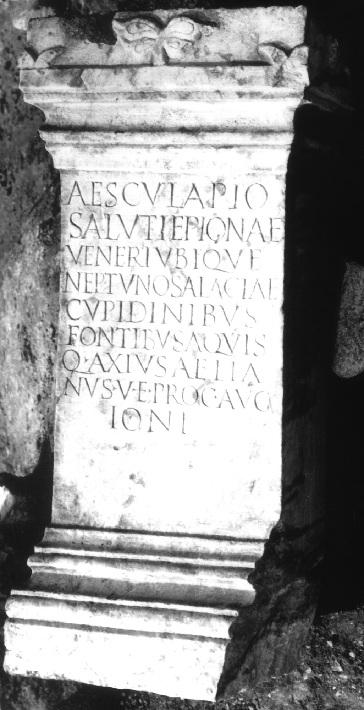

# EDH HD011035. Colonia Ulpia Traiana Sarmizegetusa

**Країна.** Румунія

**Провінція (код EDH).** Dac

**Місце знахідки (антична назва).** Colonia Ulpia Traiana Sarmizegetusa

**Сучасна назва.** Sarmizegetusa

**Деталі знахідки.** Praetorium procuratoris, {area sacra}

**Координати.** 45.515134153,22.787739334

**Зберігання.** Sarmizegetusa, Muz. Arh.

**Датування (роки, від'ємні до н. е.).** 235 … 238

**Тип пам'ятки.** Altar?

**Розміри (висота, ширина, глибина, см).** 110.0 × 48.5 × 38.0

## Текст (латинь, скорочення розкрито)

```
Aesculapio / Saluti Epionae / Veneri ubique / Neptuno Salaciae / cupidinibus / fontibus aquis / Q(uintus) Axius Aelia/nus v(ir) e(gregius) proc(urator) Aug[[g(ustorum)]] / Ioni
```

## Текст у вихідному записі

```
AESCVLAPIO / SALVTI EPIONAE / VENERI VBIQVE / NEPTVNO SALACIAE / CVPIDINIBVS / FONTIBVS AQVIS / Q AXIVS AELIA / NVS V E PROC AVG[[G]] / IONI
```

## Коментар

Altar oder Statuenbasis. Zeilenlinien für die Beschriftung. Z. 7/8: AE 1998: Aeli/anus.

## Література

AE 1998, 1101. (B)
- ILD 278.
- PIR (2. Aufl.) A 1688.
- I. Piso, ZPE 120, 1998, 264, Nr. 14; Foto. - AE 1998. #

## Фото



Джерело https://edh.ub.uni-heidelberg.de/edh/inschrift/HD011035, ліцензія CC BY-SA 4.0. Оригінальний XML в архіві сирі_дані/edh_xml.zip
