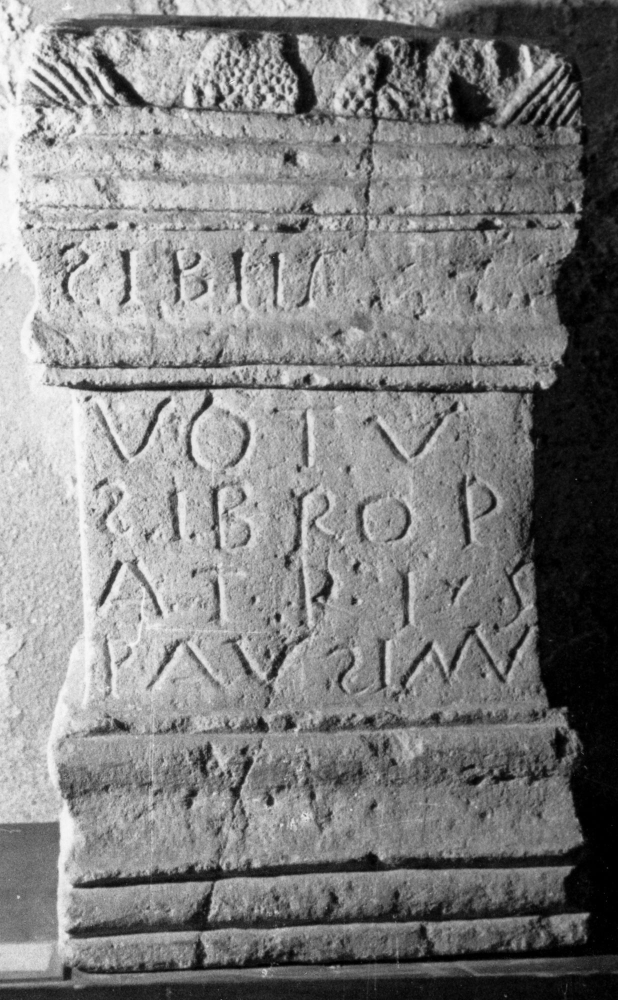

# EDH HD011426. Galda de Jos

**Країна.** Румунія

**Провінція (код EDH).** Dac

**Сучасна назва.** Galda de Jos

**Деталі знахідки.** {Benic}

**Координати.** 46.2131,23.591400000

**Рік знахідки.** 1960

**Зберігання.** Sebeş, Muzeul

**Датування (роки, від'ємні до н. е.).** 107 … 200

**Тип пам'ятки.** Altar

**Розміри (висота, ширина, глибина, см).** 59.0 × 35.0 × 22.0

## Текст (латинь, скорочення розкрито)

```
Libe(n)s // votu(m) / Lib(e)ro P/atri s(olvit)(?) / Paulianu(s)
```

## Текст у вихідному записі

```
LIBES / / VOTV / LIBRO P / ATRI S / PAVLIANV
```

## Коментар

(B): Z. 1: Popa - Aldea, AE 1973: Libiis; Z. 5: Popa - Aldea,. AE 1973, Linderski, AE 1995: Paulinu(s).

## Література

AE 1973, 0456. (B)
- AE 1995, 1294. (B)
- A. Popa - I.A. Aldea, Latomus 32, 1973, 623-625; fig. 1; fig. 2 (Zeichnung). (B) - AE 1973.
- J. Linderski, Roman questions. Selected papers (Stuttgart 1995) 366-368. (B) - AE 1995.
- IDR 3, 4, 061; fig. 30 (Foto u. Zeichnung). #

## Фото



Джерело https://edh.ub.uni-heidelberg.de/edh/inschrift/HD011426, ліцензія CC BY-SA 4.0. Оригінальний XML в архіві сирі_дані/edh_xml.zip
