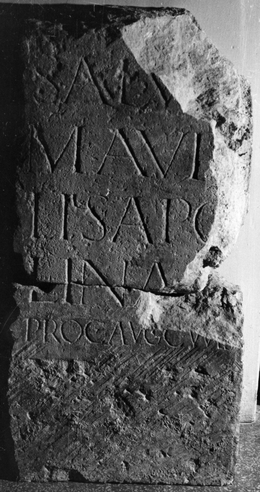

# EDH HD011451. Napoca

**Країна.** Румунія

**Провінція (код EDH).** Dac

**Місце знахідки (антична назва).** Napoca

**Сучасна назва.** Cluj-Napoca

**Деталі знахідки.** {ehemaliges Dominikanerkloster, nördliche Hofmauer}, sekundär verwendet

**Координати.** 46.772588106,23.587874472

**Рік знахідки.** 1979

**Зберігання.** Cluj-Napoca, Muz. Naţ. Ist. Transilv.

**Датування (роки, від'ємні до н. е.).** 211 … 268

**Тип пам'ятки.** Altar?

**Розміри (висота, ширина, глибина, см).** -74.0 × -38.0 × -22.0

## Текст (латинь, скорочення розкрито)

```
Salu[ti] / M(arcus) Aur[e]/lius Apo[l]/lina[ris] / proc(urator) Aug(usti) cum s(uis)
```

## Текст у вихідному записі

```
SALV[ ] / M AVR[ ] / LIVS APO[ ] / LINA[ ] / PROC AVG CVM S
```

## Коментар

Altar oder Statuenbasis. Zeilenlinien für die Beschriftung. (B): AE 1974: Z. 5: suis.

## Література

AE 1974, 0544. (B)
- ILD 553.
- M. Bărbulescu, ActaMusNapoca 10, 1973, 171-179; fig. 1a; fig. 1b u. 2 (Zeichnungen). - AE 1974. #

## Фото



Джерело https://edh.ub.uni-heidelberg.de/edh/inschrift/HD011451, ліцензія CC BY-SA 4.0. Оригінальний XML в архіві сирі_дані/edh_xml.zip
