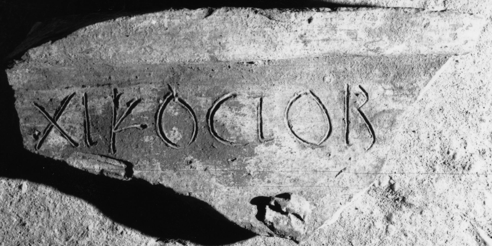

# EDH HD011496. Apulum

**Країна.** Румунія

**Провінція (код EDH).** Dac

**Місце знахідки (антична назва).** Apulum

**Сучасна назва.** Alba Iulia

**Координати.** 46.0669444,23.569999999

**Зберігання.** Alba Iulia, Muz. Unirii

**Датування (роки, від'ємні до н. е.).** 107 … 275

**Матеріал.** Ton

**Тип пам'ятки.** Ziegel

**Розміри (висота, ширина, глибина, см).** -2.0 × -32.0

## Текст (латинь, скорочення розкрито)

```
XI K(alendas) Octob(res)
```

## Текст у вихідному записі

```
XI K OCTOB
```

## Коментар

Buchstaben eingeritzt. (B): Băluţă - Băluţă; IDR III: Oktob(res).

## Література

AE 1994, 1492.
- C.L. Băluţă - C. Băluţă, EphNapocensis 4, 1994, 150, Nr. 2; pl. 1, 2 (Zeichnung). (B)- AE 1994.
- IDR 3, 6, 317; fig. 314 (Zeichnung). (B) #

## Фото



Джерело https://edh.ub.uni-heidelberg.de/edh/inschrift/HD011496, ліцензія CC BY-SA 4.0. Оригінальний XML в архіві сирі_дані/edh_xml.zip
