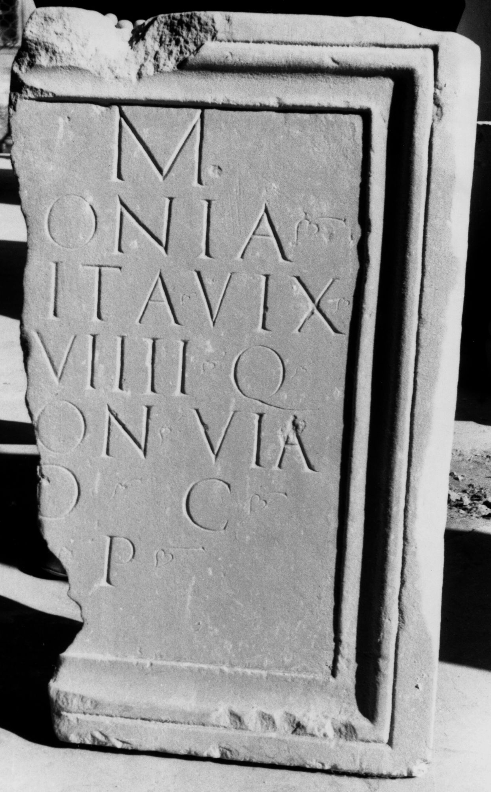

# EDH HD011617. Apulum, aus?

**Країна.** Румунія

**Провінція (код EDH).** Dac

**Місце знахідки (антична назва).** Apulum, aus?

**Сучасна назва.** Vinţu de Jos

**Деталі знахідки.** {Bahnhof}, bei

**Координати.** 45.989269293,23.498082160

**Зберігання.** Sibiu, Muz. Brukenthal

**Датування (роки, від'ємні до н. е.).** 180 … 275

**Матеріал.** Marmor

**Тип пам'ятки.** Tafel

**Розміри (висота, ширина, глибина, см).** 88.0 × -52.0 × 13.0

## Текст (латинь, скорочення розкрито)

```
[D(is)] M(anibus) / [Ant]onia / [Bon?]ita vix(it) / [ann(os)] VIIII Q(uintus) / [Ant]on(ius) Via/[tor?] d(ecurio) c(oloniae) / [---] p(osuit)
```

## Текст у вихідному записі

```
[ ] M / [ ]ONIA / [ ]ITA VIX / [ ] VIIII Q / [ ]ON VIA / [ ] D C / [ ] P
```

## Коментар

Rechter Teil einer Marmortafel. Hederae.

## Література

AE 1971, 0368.
- I.I. Russu, StudComMuzBrukenthal 12, 1965, 208, Nr. 4; fig. 4 (Zeichnung). - AE 1971.
- IDR 3, 2, 378; fig. 309 (Zeichnung).
- IDR 3, 5, 496; Foto u. Zeichnung.
- C. Ciongradi, Grabmonument und sozialer Status in Oberdakien (Cluj-Napoca 2007) 272, Nr. T/A 2; Taf. 125. #

## Фото



Джерело https://edh.ub.uni-heidelberg.de/edh/inschrift/HD011617, ліцензія CC BY-SA 4.0. Оригінальний XML в архіві сирі_дані/edh_xml.zip
