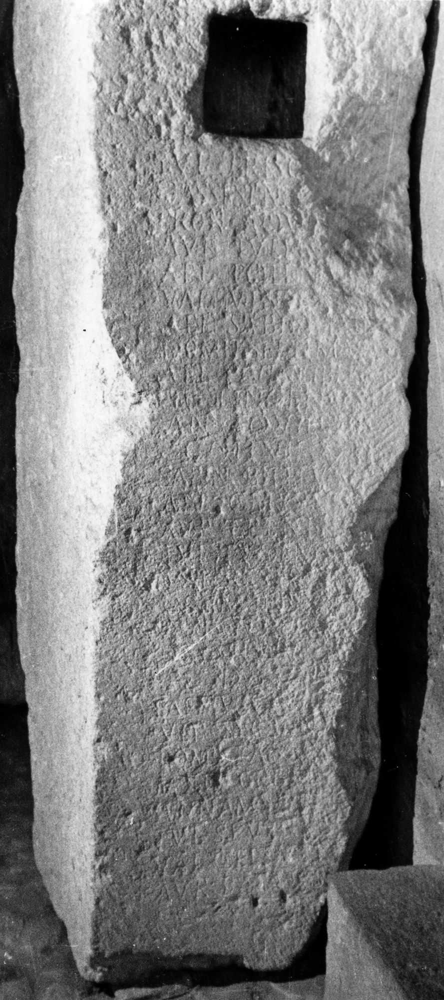

# EDH HD011623. Apulum, aus

**Країна.** Румунія

**Провінція (код EDH).** Dac

**Місце знахідки (антична назва).** Apulum, aus

**Сучасна назва.** Vinţu de Jos

**Деталі знахідки.** {Schloß Martinuzzi}, sekundär verwendet

**Координати.** 45.997319374,23.479070663

**Зберігання.** Sebeş, Muzeul

**Датування (роки, від'ємні до н. е.).** 171 … 230

**Матеріал.** Gesteine?

**Тип пам'ятки.** Architekturteil

**Розміри (висота, ширина, глибина, см).** -120.0 × -39.0 × -60.0

## Текст (латинь, скорочення розкрито)

```
$] / [---]N[---] / [------] / [-]E[---] / [-]I / Ael(ius) [---] / Iul(ius) Prisc[us?] / Cassi(us) Senec[io?] / Fron(tius?) Aqu[ila?] / Aur(elius) Iuli[anus] / Ael(ius) Poten[s?] / Val(erius) Vindex / Ael(ius) Sabin[us?] / Domit(ius) Septimu[s] / Ael(ius) Qui[-]miber(?) / Iul(ius?) Ingen[uus] / Ant(onius) Aquilin[u]s / coh(ortis) VII / Sabin(ius) Bithu[s] / Ael(ius) Crispus / Aur(elius) Teren[t]i[anus] / Iul(ius) I[u]s[t]us / [------] / [------] / S[---] / [------] / Ael(ius) Din[es?] / Sabin(ius) Vic[tor?] / Ulp(ius) Secu[ndus?] / Pomp(---) Ianu[arius] / Maxi(mius) Corn[elianus] / Ann(ius) Amu[---] / Iul(ius) Severus / Val(erius) Celsus / Aur(elius) Batav(u)s
```

## Текст у вихідному записі

```
] / [ ]N[ ] / [ ] / [ ]E[ ] / [ ]I / AEL [ ] / IVL PRISC[ ] / CASSI SENEC[ ] / FRON AQV[ ] / AVR IVLI[ ] / AEL POTEN[ ] / VAL VINDEX / AEL SABIN[ ] / DOMIT SEPTIMV[ ] / AEL QVI[ ]MIBER / IVL INGEN[ ] / ANT AQVILIN[ ]S / COH VII / SABIN BITHV[ ] / AEL CRISPVS / AVR TEREN[ ]I[ ] / IVL I[ ]S[ ]VS / [ ] / [ ] / S[ ] / [ ] / AEL DIN[ ] / SABIN VIC[ ] / VLP SECV[ ] / POMP IANV[ ] / MAXI CORN[ ] / ANN AMV[ ] / IVL SEVERVS / VAL CELSVS / AVR BATAVS
```

## Коментар

Inschrift stammt aus dem Gebiet südlich von Alba Iulia. Eingangspfeiler. In späterer Zeit bearbeitet und als Baustein wiederverwendet. (B): Wollmann; AE 1971: Z. 2: t[--- /; Z. 17: Corn(elius) Vlp[ianus]; Z. 28: Vet(urius?) [---]; Z. 31: Valer(ius) Am[andus?].

## Література

AE 1971, 0370. (B)
- U. Wollmann, ActaMusNapoca 7, 1970, 166-169, Nr. 2; fig. 2. - AE 1971. (B)
- IDR 3, 5, 451; Zeichnung. #

## Фото



Джерело https://edh.ub.uni-heidelberg.de/edh/inschrift/HD011623, ліцензія CC BY-SA 4.0. Оригінальний XML в архіві сирі_дані/edh_xml.zip
