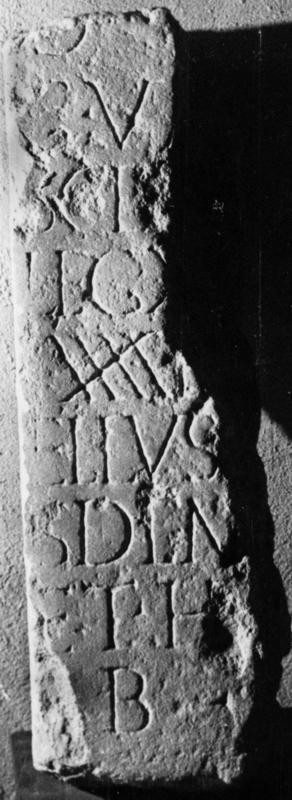

# EDH HD011626. Apulum, aus?

**Країна.** Румунія

**Провінція (код EDH).** Dac

**Місце знахідки (антична назва).** Apulum, aus?

**Сучасна назва.** Sebeş

**Деталі знахідки.** {lutheranische Kirche}, sekundär verwendet

**Координати.** 45.957556986,23.568023443

**Рік знахідки.** 1961

**Зберігання.** Sebeş, Muzeul

**Датування (роки, від'ємні до н. е.).** 171 … 270

**Матеріал.** Kalkstein

**Тип пам'ятки.** Stele

**Розміри (висота, ширина, глибина, см).** -84.0 × -28.0 × 18.0

## Текст (латинь, скорочення розкрито)

```
D(is) [M(anibus)] / G(aius) Va[leriu]/s Cl[emens -] / leg(ionis) X[III g(eminae) v(ixit) a(nnos)] / XXXXI[---]/ellus [- leg(ionis)] / [eiu]/sdem [---] / et he[re---] / b(ene) [m(erenti)]
```

## Текст у вихідному записі

```
D [ ] / G VA[ ] / S CL[ ] / LEG X[ ] / XXXXI[ ] / ELLVS [ ] / [ ] / SDEM [ ] / ET HE[ ] / B [ ]
```

## Коментар

Z. 8: he[res] oder he[redes]; HE-Ligatur. (B): IDR III 5, 587; Ciongradi: Z. 2/3: Va[leriu]s; Wollmann; AE 1971: Z. 8: h[eres.

## Література

AE 1971, 0371. (B)
- V. Wollmann, ActaMusNapoca 7, 1970, 169-170, Nr. 3; fig. 3. (B) - AE 1971.
- IDR 3, 5, 587; Foto u. Zeichnung. (B)
- C. Ciongradi, Grabmonument und sozialer Status in Oberdakien (Cluj-Napoca 2007) 188, Nr. S/A 105. (B) #

## Фото



Джерело https://edh.ub.uni-heidelberg.de/edh/inschrift/HD011626, ліцензія CC BY-SA 4.0. Оригінальний XML в архіві сирі_дані/edh_xml.zip
