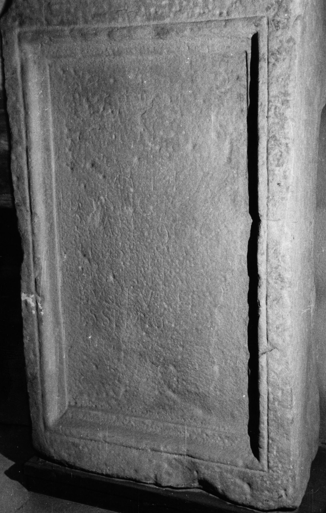
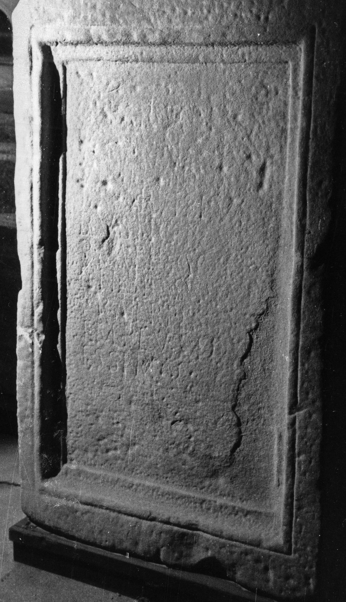

# EDH HD011674. Voila

**Країна.** Румунія

**Провінція (код EDH).** Dac

**Сучасна назва.** Voila

**Деталі знахідки.** {Cincşor}, bei, "Schlehenreg"

**Координати.** 45.8375341,24.833017700

**Зберігання.** Sibiu, Muz. Brukenthal

**Датування (роки, від'ємні до н. е.).** 151 … 270

**Розміри (висота, ширина, глибина, см).** 138.0 × 85.0 × 30.0

## Текст (латинь, скорочення розкрито)

```
[D(is) M(anibus)] s(acrum) / [-] Carvilius / [Se]cun[dinus] / vixit an(nos) [---] / L(ucius) [Car]vilius / Rusticinus / praef(ectus) coh(ortis) / II Fl(aviae) Bess(orum) / fratri in ex/emplum pi/issimo p(onendum) c(uravit)
```

## Текст у вихідному записі

```
[ ] S / [ ] CARVILIVS / [ ]CVN[ ] / VIXIT AN [ ] / L [ ]VILIVS / RVSTICINVS / PRAEF COH / II FL BESS / FRATRI IN EX / EMPLVM PI / ISSIMO P C
```

## Коментар

Oberfläche des Inschriftfeldes stark verrieben. (B): Russu; AE 1971: abweichende Textwiedergabe.

## Література

AE 1971, 0379. (B)
- I.I. Russu, StudComMuzBrukenthal 12, 1965, 208-210, Nr. 5; fig. 5 (Zeichnung). (B) - AE 1971.
- IDR 3, 4, 179; fig. 106 (Zeichnung). #

## Фото





Джерело https://edh.ub.uni-heidelberg.de/edh/inschrift/HD011674, ліцензія CC BY-SA 4.0. Оригінальний XML в архіві сирі_дані/edh_xml.zip
