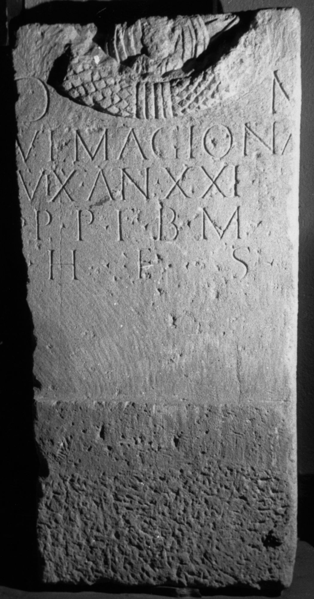

# EDH HD011677. Şura Mică

**Країна.** Румунія

**Провінція (код EDH).** Dac

**Сучасна назва.** Şura Mică

**Деталі знахідки.** {lutheranische Kirche}, sekundär verwendet

**Координати.** 45.832723962,24.053750038

**Зберігання.** Sibiu, Muz. Brukenthal

**Датування (роки, від'ємні до н. е.).** 151 … 200

**Тип пам'ятки.** Stele

**Розміри (висота, ширина, глибина, см).** -152.0 × -76.0 × 20.0

## Текст (латинь, скорочення розкрито)

```
D(is) M(anibus) / [I]ul(ia) Magiona / vix(it) an(nos) XXI / p(ater) p(osuit) f(iliae) b(ene) m(erenti) / h(ic) e(st) s(ita)
```

## Текст у вихідному записі

```
D M / [ ]VL MAGIONA / VIX AN XXI / P P F B M / H E S
```

## Коментар

Oberhalb des Inschriftfeldes noch der untere Teil eines Kranzes mit den Büsten einer Frau und eines Kindes.

## Література

AE 1971, 0380.
- I.I. Russu, StudComMuzBrukenthal 12, 1965, 210, Nr. 6; fig. 6 (Zeichnung). - AE 1971.
- IDR 3, 4, 088; fig. 46 (Foto u. Zeichnung). #

## Фото



Джерело https://edh.ub.uni-heidelberg.de/edh/inschrift/HD011677, ліцензія CC BY-SA 4.0. Оригінальний XML в архіві сирі_дані/edh_xml.zip
