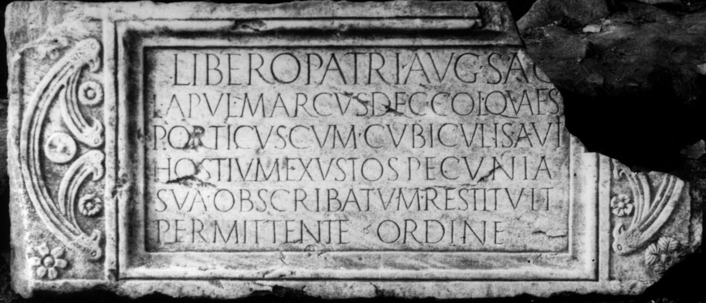

# EDH HD012378. Colonia Ulpia Traiana Sarmizegetusa

**Країна.** Румунія

**Провінція (код EDH).** Dac

**Місце знахідки (антична назва).** Colonia Ulpia Traiana Sarmizegetusa

**Сучасна назва.** Sarmizegetusa

**Деталі знахідки.** {Tempel des Liber Pater}

**Координати.** 45.517763484,22.787393331

**Зберігання.** Sarmizegetusa, Muz. Arh.

**Датування (роки, від'ємні до н. е.).** 170 … 180

**Тип пам'ятки.** Tafel

**Розміри (висота, ширина, глибина, см).** 66.0 × 155.0 × 18.0

## Текст (латинь, скорочення розкрито)

```
Libero Patri Aug(usto) sac(rum) / L(ucius) Apul(eius) Marcus dec(urio) col(oniae) quaes(tor) / porticus cum cubiculis a vii(!) / hostium exustos pecunia / sua ob scribatum restituit / permittente ordine
```

## Текст у вихідному записі

```
LIBERO PATRI AVG SAC / L APVL MARCVS DEC COL QVAES / PORTICVS CVM CVBICVLIS A VII / HOSTIVM EXVSTOS PECVNIA / SVA OB SCRIBATVM RESTITVIT / PERMITTENTE ORDINE
```

## Коментар

Zeilenlinien für die Beschriftung. Datierung: nach einem Angriff der Markomannen oder Jazygen 170 n. Chr., zur Zeit der Alleinherrschaft des Mark Aurel. (B): Daicoviciu - Piso; IDR III: Leseabweichungen.

## Література

AE 1976, 0561.
- IDR 3, 2, 011; fig. 9 (Zeichnung). (B)
- H. Daicoviciu - I. Piso, ActaMusNapoca 12, 1975, 159-163; fig. 1 (Foto u. Zeichnung). (B) - AE 1976.
- H. Daicoviciu - I. Piso, RRoumHist 16, 1977, 155-159; fig. 1. (B) - AE 1976. #

## Фото



Джерело https://edh.ub.uni-heidelberg.de/edh/inschrift/HD012378, ліцензія CC BY-SA 4.0. Оригінальний XML в архіві сирі_дані/edh_xml.zip
