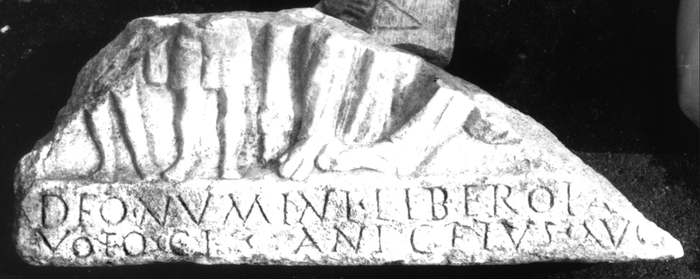

# EDH HD012381. Colonia Ulpia Traiana Sarmizegetusa

**Країна.** Румунія

**Провінція (код EDH).** Dac

**Місце знахідки (антична назва).** Colonia Ulpia Traiana Sarmizegetusa

**Сучасна назва.** Sarmizegetusa

**Деталі знахідки.** {Tempel des Liber Pater}

**Координати.** 45.517763484,22.787393331

**Зберігання.** Sarmizegetusa, Muz. Arh.

**Датування (роки, від'ємні до н. е.).** 222 … 235

**Тип пам'ятки.** Relief

**Розміри (висота, ширина, глибина, см).** -14.0 × -36.0 × 4.0

## Текст (латинь, скорочення розкрито)

```
Deo numini Libero Pa[tri ex] / voto Cl(audius) Anicetus Aug(ustalis) [col(oniae)]
```

## Текст у вихідному записі

```
DEO NVMINI LIBERO PA[ ] / VOTO CL ANICETVS AVG [ ]
```

## Коментар

Unterer Teil eines Reliefs wohl mit Liber und seinem Gefolge; Die Inschrift befindet sich auf dem unteren Rahmen. (B): AE 1976: Z. 1: Pat[ri].

## Література

AE 1976, 0562. (B)
- H. Daicoviciu - I. Piso, ActaMusNapoca 13, 1976, 89-90, Nr. 1; fig. 1 (Foto u. Zeichnung). - AE 1976.
- IDR 3, 2, 251; fig. 203 (Foto u. Zeichnung). #

## Фото



Джерело https://edh.ub.uni-heidelberg.de/edh/inschrift/HD012381, ліцензія CC BY-SA 4.0. Оригінальний XML в архіві сирі_дані/edh_xml.zip
