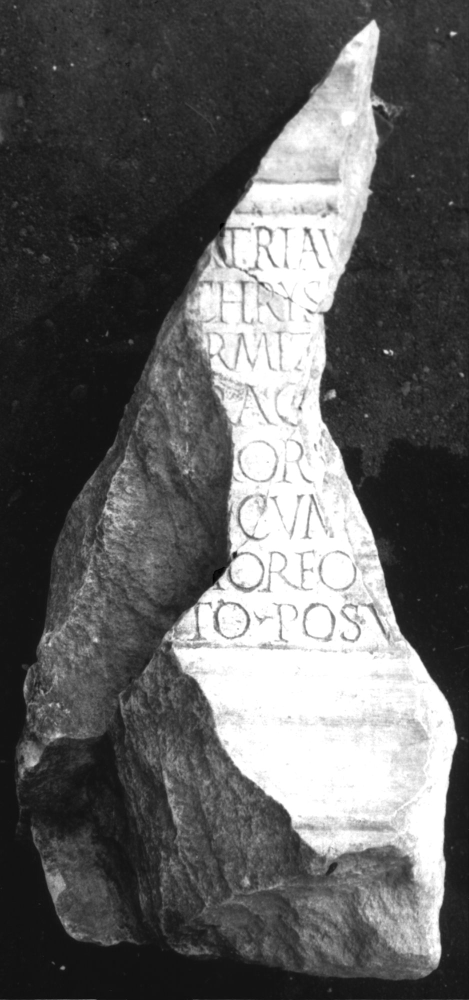

# EDH HD012390. Colonia Ulpia Traiana Sarmizegetusa

**Країна.** Румунія

**Провінція (код EDH).** Dac

**Місце знахідки (антична назва).** Colonia Ulpia Traiana Sarmizegetusa

**Сучасна назва.** Sarmizegetusa

**Деталі знахідки.** {Tempel des Liber Pater}

**Координати.** 45.517763484,22.787393331

**Зберігання.** Sarmizegetusa, Muz. Arh.

**Датування (роки, від'ємні до н. е.).** 131 … 250

**Тип пам'ятки.** Altar

**Розміри (висота, ширина, глибина, см).** -53.0 × -24.0 × -27.0

## Текст (латинь, скорочення розкрито)

```
[Libero P]atri Au[g(usto) sacr(um)?] / [---] Chrys[---] / [Aug(ustalis)? col(oniae) Sa]rmiz(egetusae) [---] / [---]ra c[---] / [---]M(?)or[---] / [---] cum[---] / [---]M(?)orfo[---] / [--- mer]ito posu[it]
```

## Текст у вихідному записі

```
[ ]ATRI AV[ ] / [ ] CHRYS[ ] / [ ]RMIZ [ ] / [ ]RA C[ ] / [ ]MOR[ ] / [ ] CVM[ ] / [ ]MORFO[ ] / [ ]ITO POSV[ ]
```

## Література

AE 1976, 0565.
- IDR 3, 2, 252; fig. 204 (Foto u. Zeichnung).
- H. Daicoviciu - I. Piso, ActaMusNapoca 13, 1976, 92-93, Nr. 4; fig. 4 (Foto u. Zeichnung). - AE 1976. #

## Фото



Джерело https://edh.ub.uni-heidelberg.de/edh/inschrift/HD012390, ліцензія CC BY-SA 4.0. Оригінальний XML в архіві сирі_дані/edh_xml.zip
