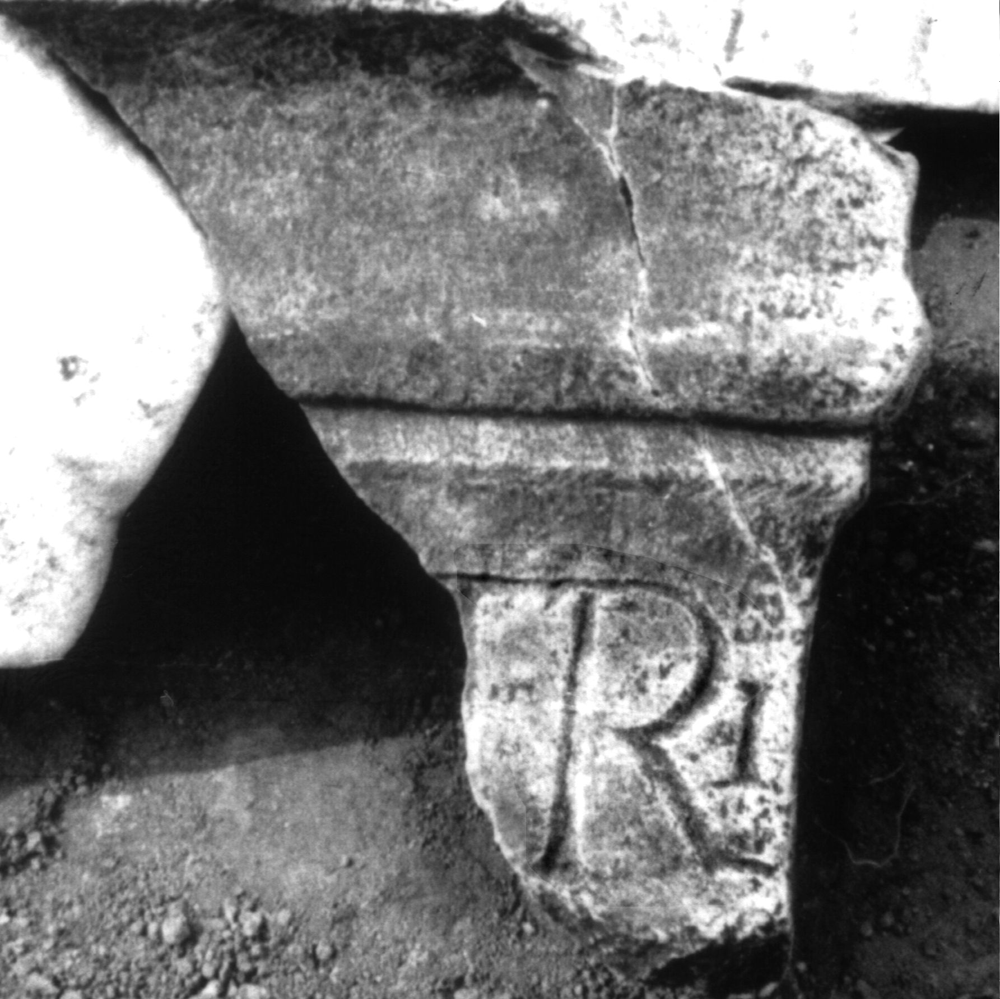

# EDH HD012393. Colonia Ulpia Traiana Sarmizegetusa

**Країна.** Румунія

**Провінція (код EDH).** Dac

**Місце знахідки (антична назва).** Colonia Ulpia Traiana Sarmizegetusa

**Сучасна назва.** Sarmizegetusa

**Деталі знахідки.** {Tempel des Liber Pater}

**Координати.** 45.517763484,22.787393331

**Зберігання.** Sarmizegetusa, Muz. Arh.

**Датування (роки, від'ємні до н. е.).** 131 … 250

**Тип пам'ятки.** Altar

**Розміри (висота, ширина, глибина, см).** -18.0 × -20.0 × -12.0

## Текст (латинь, скорочення розкрито)

```
[Libero Pa]tri / [&
```

## Текст у вихідному записі

```
[ ]TRI / [
```

## Література

AE 1976, 0566.
- IDR 3, 2, 258; fig. 210.
- H. Daicoviciu - I. Piso, ActaMusNapoca 13, 1976, 93, Nr. 6; fig. 6. - AE 1976. #

## Фото



Джерело https://edh.ub.uni-heidelberg.de/edh/inschrift/HD012393, ліцензія CC BY-SA 4.0. Оригінальний XML в архіві сирі_дані/edh_xml.zip
