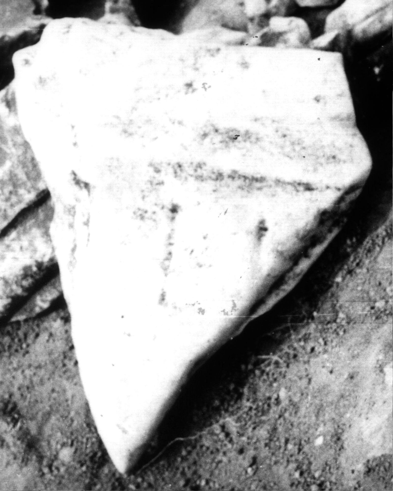

# EDH HD012396. Colonia Ulpia Traiana Sarmizegetusa

**Країна.** Румунія

**Провінція (код EDH).** Dac

**Місце знахідки (антична назва).** Colonia Ulpia Traiana Sarmizegetusa

**Сучасна назва.** Sarmizegetusa

**Деталі знахідки.** {Tempel des Liber Pater}

**Координати.** 45.517763484,22.787393331

**Зберігання.** Sarmizegetusa, Muz. Arh.

**Датування (роки, від'ємні до н. е.).** 131 … 270

**Розміри (висота, ширина, глибина, см).** -35.0 × -29.0 × -8.0

## Текст (латинь, скорочення розкрито)

```
Li[bero &
```

## Текст у вихідному записі

```
LI[
```

## Література

AE 1976, 0567.
- IDR 3, 2, 259; fig. 211.
- H. Daicoviciu - I. Piso, ActaMusNapoca 13, 1976, 93, Nr. 7; fig. 7. - AE 1976. #

## Фото



Джерело https://edh.ub.uni-heidelberg.de/edh/inschrift/HD012396, ліцензія CC BY-SA 4.0. Оригінальний XML в архіві сирі_дані/edh_xml.zip
