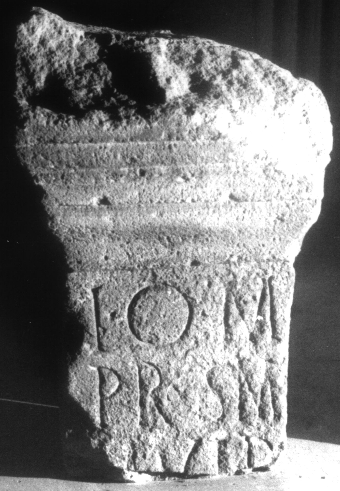

# EDH HD012674. Apulum

**Країна.** Румунія

**Провінція (код EDH).** Dac

**Місце знахідки (антична назва).** Apulum

**Сучасна назва.** Alba Iulia

**Координати.** 46.0669444,23.569999999

**Зберігання.** Alba Iulia, Muz. Unirii

**Датування (роки, від'ємні до н. е.).** 151 … 300

**Матеріал.** Kalkstein

**Тип пам'ятки.** Altar?

**Розміри (висота, ширина, глибина, см).** -50.0 × -28.0 × -20.0

## Текст (латинь, скорочення розкрито)

```
I(ovi) O(ptimo) M(aximo) / pro s(alute) M/M(arcorum?) Ulp(iorum?) / [& // Io[vi?] / [&?
```

## Текст у вихідному записі

```
I O M / PRO S M / M VLP / [ / / IO[ ] / [
```

## Коментар

Altar oder Statuenbasis. Zwei Inschriften auf der Vorderseite bzw. auf der rechten Nebenseite. Z. 2/3: möglicherweise auch M(arci) / {M} Ulp(i).

## Література

AE 1987, 0830.
- IDR 3, 5, 179; Fotos u. Zeichnungen.
- I. Piso, ActaMusNapoca 22/23, 1985/86, 487, Nr. 1; fig. a u. 1b; fig. 1c u. 1d (Zeichnungen). - AE 1987. #

## Фото



Джерело https://edh.ub.uni-heidelberg.de/edh/inschrift/HD012674, ліцензія CC BY-SA 4.0. Оригінальний XML в архіві сирі_дані/edh_xml.zip
