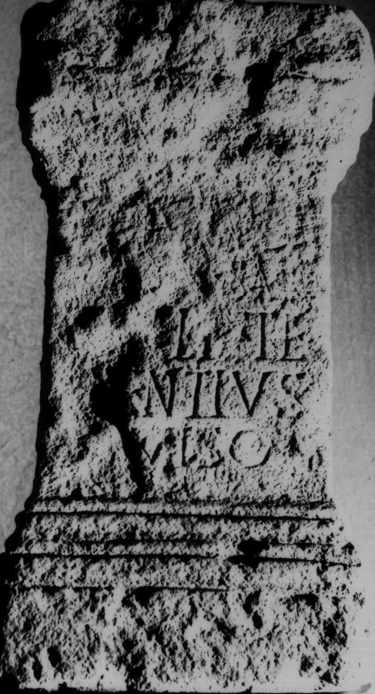

# EDH HD012677. Apulum

**Країна.** Румунія

**Провінція (код EDH).** Dac

**Місце знахідки (антична назва).** Apulum

**Сучасна назва.** Alba Iulia

**Деталі знахідки.** {Partoş}

**Координати.** 46.0463184,23.566650100

**Зберігання.** Alba Iulia, Muz. Unirii

**Датування (роки, від'ємні до н. е.).** 151 … 270

**Матеріал.** Kalkstein

**Тип пам'ятки.** Altar

**Розміри (висота, ширина, глибина, см).** -44.0 × -24.0 × 17.0

## Текст (латинь, скорочення розкрито)

```
[Sil]v[a]no / [---] sac(rum) / [M(arcus) U]lp(ius) Te/rentius / ex viso / p(osuit)
```

## Текст у вихідному записі

```
[ ]V[ ]NO / [ ] SAC / [ ]LP TE / RENTIVS / EX VISO / P
```

## Коментар

Bekrönung und Inschriftfeld heute stark verwittert.

## Література

AE 1987, 0831.
- I. Piso, ActaMusNapoca 22/23, 1985/86, 488-489, Nr. 3; fig. 3a (Foto); fig. 3b (Zeichnung). - AE 1987.
- CIL 03, 01167.
- IDR 3, 5, 343; Foto u. Zeichnung. #

## Фото



Джерело https://edh.ub.uni-heidelberg.de/edh/inschrift/HD012677, ліцензія CC BY-SA 4.0. Оригінальний XML в архіві сирі_дані/edh_xml.zip
