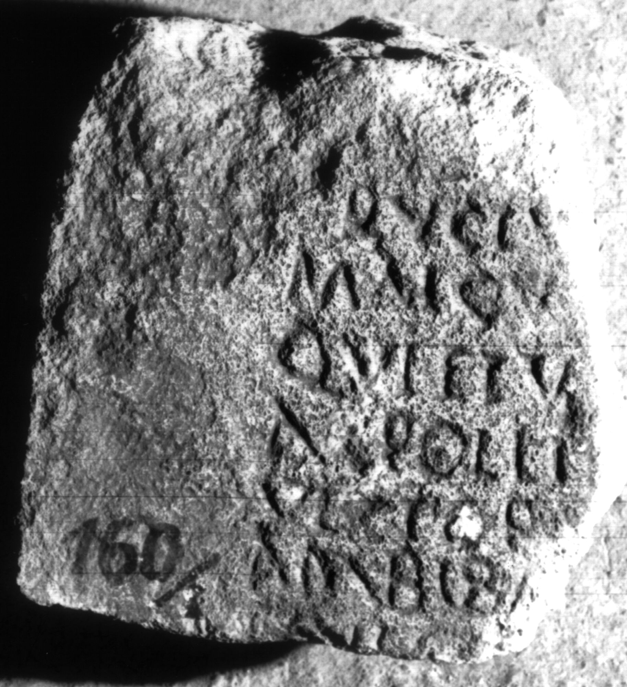

# EDH HD012686. Apulum

**Країна.** Румунія

**Провінція (код EDH).** Dac

**Місце знахідки (антична назва).** Apulum

**Сучасна назва.** Alba Iulia

**Координати.** 46.0669444,23.569999999

**Зберігання.** Alba Iulia, Muz. Unirii

**Датування (роки, від'ємні до н. е.).** 107 … 275

**Матеріал.** Kalkstein

**Тип пам'ятки.** Tafel

**Розміри (висота, ширина, глибина, см).** -20.0 × -20.0 × 18.0

## Текст (латинь, скорочення розкрито)

```
$]D[---] / [-] Ruciu[---] / Malcu[s ---] / Quietu[s] / Apollin[aris ---] / Victori[nus ---] / AMBIBA(?) / qui[&
```

## Текст у вихідному записі

```
]D[ ] / [ ] RVCIV[ ] / MALCV[ ] / QVIETV[ ] / APOLLIN[ ] / VICTORI[ ] / AMBIBA / QVI[
```

## Коментар

Rechter Teil einer Tafel.

## Література

AE 1987, 0836.
- I. Piso, ActaMusNapoca 22/23, 1985/86, 495, Nr. 9; fig. 9a (Foto); fig. 9b (Zeichnung). - AE 1987.
- IDR 3, 5, 460; Foto u. Zeichnung. #

## Фото



Джерело https://edh.ub.uni-heidelberg.de/edh/inschrift/HD012686, ліцензія CC BY-SA 4.0. Оригінальний XML в архіві сирі_дані/edh_xml.zip
