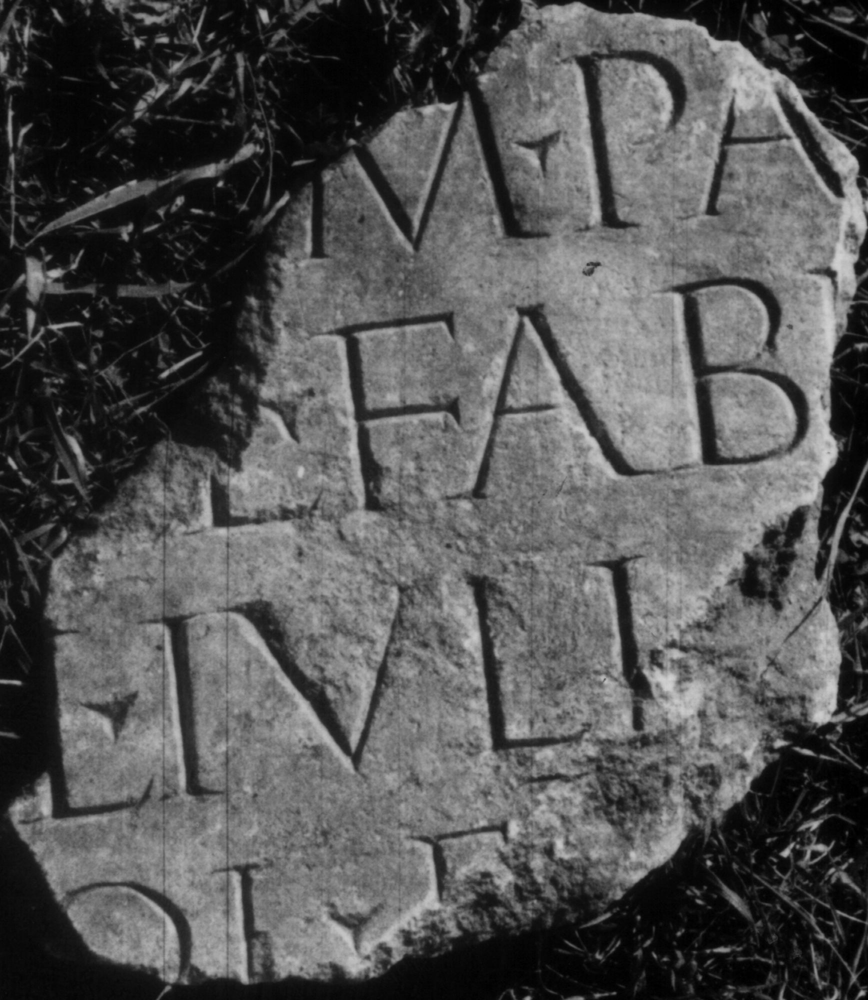

# EDH HD012692. Colonia Ulpia Traiana Sarmizegetusa, bei

**Країна.** Румунія

**Провінція (код EDH).** Dac

**Місце знахідки (антична назва).** Colonia Ulpia Traiana Sarmizegetusa, bei

**Сучасна назва.** Toteşti

**Деталі знахідки.** {Păclişa}

**Координати.** 45.562880041,22.880414677

**Зберігання.** Deva, Muz. Civil. Dac. şi Rom.

**Датування (роки, від'ємні до н. е.).** 108 … 150

**Розміри (висота, ширина, глибина, см).** -24.0 × -23.0 × -9.0

## Текст (латинь, скорочення розкрито)

```
$] / [col(oniae)?] / [Dac(icae)? Sar?]m(izegetusae?) pa[tro]/[no col]l(egii) fabr(um) [M(arcus)?] / [Proci?]l(ius) Iuli[anus] / [dec(urio)? c]ol(oniae) e[q(uo)? publ(ico)?] / [&
```

## Текст у вихідному записі

```
] / [ ] / [ ]M PA[ ] / [ ]L FABR [ ] / [ ]L IVLI[ ] / [ ]OL E[ ] / [
```

## Коментар

Z. 5: statt E auch F möglich; Piso: e[iusdem]; CIL III: f[abrum]. Zu M. Procilius Iulianus s. AE 1927, 54 (= IDR 3, 2, 118). (B): Petolescu; AE 1987; ILD: Z. 2: fab[r(um)]; ILD Z. 3: [Proci]ll(ius). Ergänzungen weitgehend nach Piso und Petolescu; Zeilenfälle geändert.

## Література

AE 1987, 0838. (B)
- C.C. Petolescu, StCercIstorV 38, 1987, 180. 183, Nr. 1. (B) - AE 1987.
- I. Piso, Apulum 15, 1977, 648, Nr. 3; fig. 3 (Foto u. Zeichnung). - AE 1987.
- CIL 03, 13787.
- IDR 3, 2, 114; fig. 89 (Foto u. Zeichnung). (B)
- ILD 242. (B) #

## Фото



Джерело https://edh.ub.uni-heidelberg.de/edh/inschrift/HD012692, ліцензія CC BY-SA 4.0. Оригінальний XML в архіві сирі_дані/edh_xml.zip
