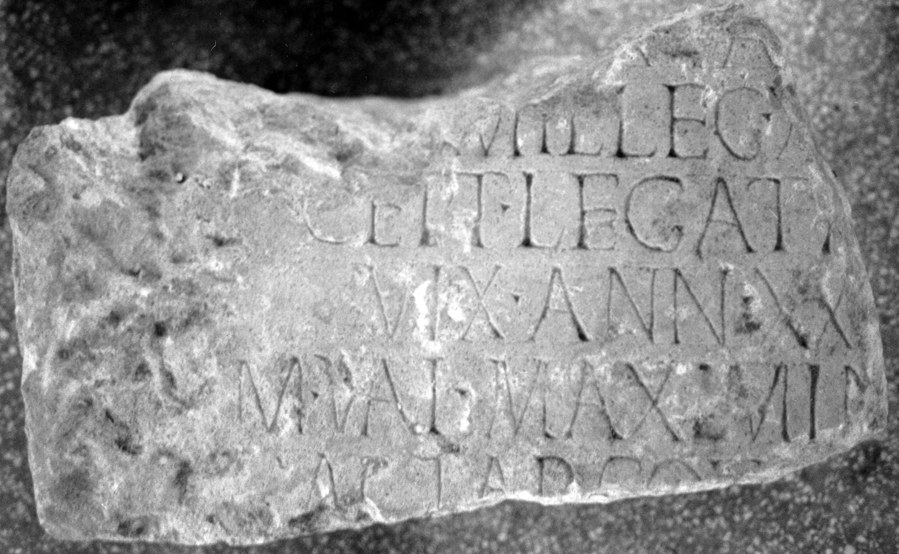

# EDH HD012698. Napoca

**Країна.** Румунія

**Провінція (код EDH).** Dac

**Місце знахідки (антична назва).** Napoca

**Сучасна назва.** Cluj-Napoca

**Деталі знахідки.** {Strada Dostoievski} 5, spätantike Nekropole, sekundär verwendet

**Координати.** 46.767716715,23.603431284

**Зберігання.** Cluj-Napoca, Muz. Naţ. Ist. Transilv.

**Датування (роки, від'ємні до н. е.).** 151 … 230

**Тип пам'ятки.** Tafel

**Розміри (висота, ширина, глибина, см).** -53.0 × -30.0 × 18.0

## Текст (латинь, скорочення розкрито)

```
$]VA[---] / [---] mil(es) leg(ionis) X[III g(eminae) ex]/cept(or) legati [Aug(usti)] / vix(it) ann(os) XX[---] / M(arcus) Val(erius) Max[i]min[us --] / actar(ius) coh(ortis) [---] / [&
```

## Текст у вихідному записі

```
]VA[ ] / [ ] MIL LEG X[ ] / CEPT LEGATI [ ] / VIX ANN XX[ ] / M VAL MAX[ ]MIN[ ] / ACTAR COH [ ] / [
```

## Коментар

Zeilen zentriert. (B): Ardevan - Hica-Cimpeanu: Z. 3: leg(ati).

## Література

AE 1987, 0841.
- R. Ardevan - I. Hica-Cimpeanu, ActaMusNapoca 22/23, 1985/86, 544. 548, Nr. 4; fig. 4a; fig. 4b (Zeichnung). (B) - AE 1987.
- ILD 561. #

## Фото



Джерело https://edh.ub.uni-heidelberg.de/edh/inschrift/HD012698, ліцензія CC BY-SA 4.0. Оригінальний XML в архіві сирі_дані/edh_xml.zip
