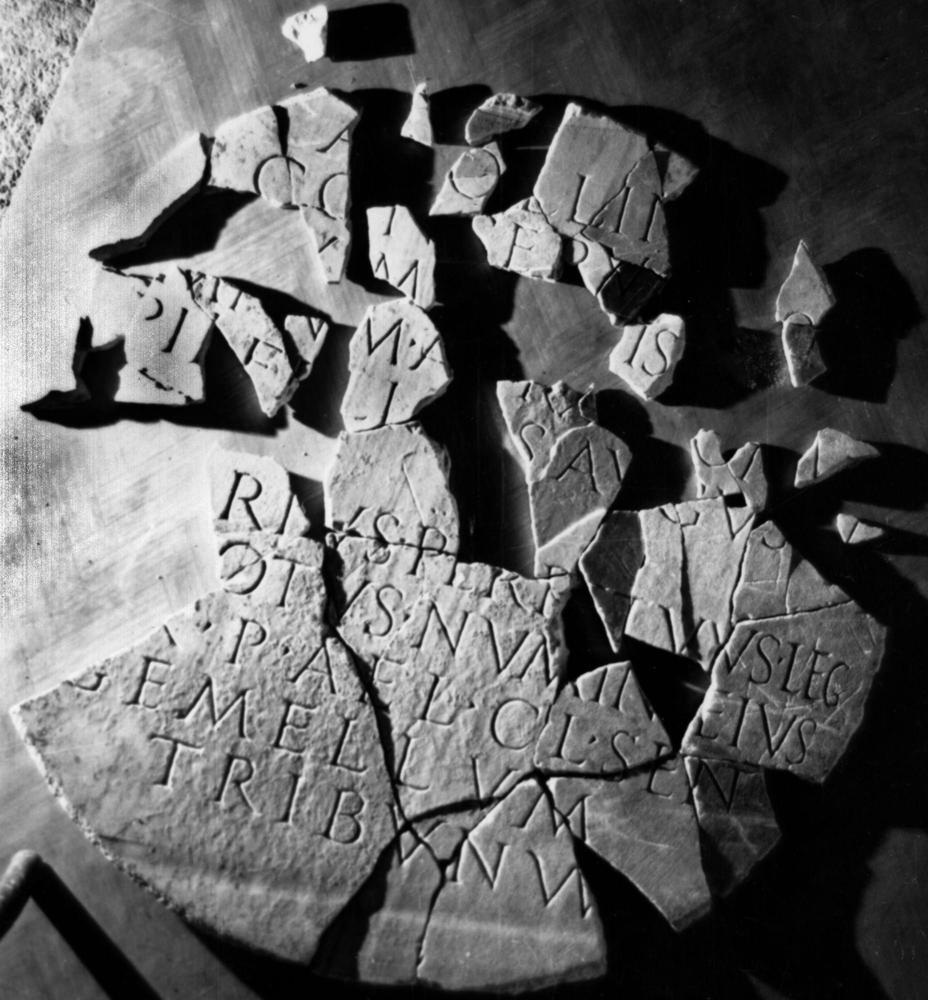

# EDH HD012719. Tibiscum, bei

**Країна.** Румунія

**Провінція (код EDH).** Dac

**Місце знахідки (антична назва).** Tibiscum, bei

**Сучасна назва.** Obreja

**Деталі знахідки.** Iaz, bei, {Apollonheiligtum}

**Координати.** 45.469164015,22.218534394

**Зберігання.** Reşiţa, Muz. Jud. Ist.

**Датування (роки, від'ємні до н. е.).** 212 … 215

**Тип пам'ятки.** Tafel

**Розміри (висота, ширина, глибина, см).** 100.0 × 3.0

## Текст (латинь, скорочення розкрито)

```
Apollin[i] / conserva[to]ri / [ma]x[i]mi [sa]nctis[si]miq(ue) / [I]mp(eratoris) n(ostri) M(arci) A[u]r(eli) A[nt]on[i]n[i] / Pii Felic[i]s Augus[ti] / [L(ucius) M]arius Perpetuus leg(atus) / [de]votus numin[i] eius / [pe]r P(ublium) Ael(ium) Cl(audia) Sent(ino) / Gemellum / tribunum
```

## Текст у вихідному записі

```
APOLLIN[ ] / CONSERVA[ ]RI / [ ]X[ ]MI [ ]NCTIS[ ]MIQ / [ ]MP N M A[ ]R A[ ]ON[ ]N[ ] / PII FELIC[ ]S AVGVS[ ] / [ ]ARIVS PERPETVVS LEG / [ ]VOTVS NVMIN[ ] EIVS / [ ]R P AEL CL SENT / GEMELLVM / TRIBVNVM
```

## Коментар

Kreisrunde Tafel, die für die Beschriftung aus einer rechteckigen Tafel ausgesägt wurde; in zahlreiche Fragmente gebrochen. (B): Groza - Wollmann; AE 1976; Piso; Piso - Rogozea; AE 1987; IDR; ILD: Leseabweichungen.

## Література

AE 2000, 1233.
- AE 1987, 0849. (B)
- AE 1978, 0682.
- AE 1976, 0579. (B)
- ILD 200. (B)
- IDR 3, 1, 128; fig. 97 (Foto u. Zeichnung). (B)
- PIR (2. Aufl.) M 311.
- L. Balla, in: HPS 5 (Debrecen 2000) 183-184, Nr. 1. - AE 2000.
- I. Piso - P. Rogozea, ZPE 58, 1985, 214-218, Nr. 2; Taf. 15d; Abb. 2 (Zeichnung). (B) - AE 1987.
- I. Piso, ActaMusNapoca 15, 1978, 184-186, Nr. 4; fig. 7; fig. 8 (Zeichnung). (B) - AE 1978.
- L. Groza - V. Wollmann, ActaMusNapoca 13, 1976, 166; fig. 3a; fig. 3b (Zeichnung). (B) - AE 1976. #

## Фото



Джерело https://edh.ub.uni-heidelberg.de/edh/inschrift/HD012719, ліцензія CC BY-SA 4.0. Оригінальний XML в архіві сирі_дані/edh_xml.zip
