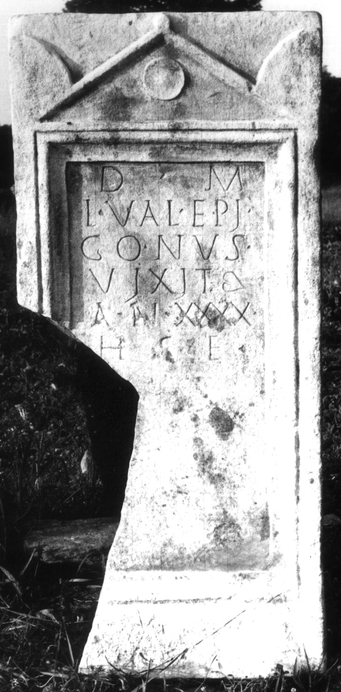

# EDH HD013983. Colonia Ulpia Traiana Sarmizegetusa

**Країна.** Румунія

**Провінція (код EDH).** Dac

**Місце знахідки (антична назва).** Colonia Ulpia Traiana Sarmizegetusa

**Сучасна назва.** Sarmizegetusa

**Деталі знахідки.** {Stadtmauer, südlich}, Nekropole

**Координати.** 45.510031134,22.787135838

**Рік знахідки.** 1977

**Зберігання.** Sarmizegetusa, Muz. Arh.

**Датування (роки, від'ємні до н. е.).** 171 … 230

**Тип пам'ятки.** Stele

**Розміри (висота, ширина, глибина, см).** 133.0 × 60.0 × 16.0

## Текст (латинь, скорочення розкрито)

```
D(is) M(anibus) / L(ucius) Val(erius) Epi/gonus / vixit / an(nos) XXXX / h(ic) s(itus) e(st)
```

## Текст у вихідному записі

```
D M / L VAL EPI / GONVS / VIXIT / AN XXXX / H S E
```

## Коментар

Hedera am Ende von Z. 4. (B): Piso: Z. 4/5: vixit an(nos).

## Література

AE 1978, 0671.
- I. Piso, Apulum 16, 1978, 192-194, Nr. 5; fig. 3. (B) - AE 1978.
- IDR 3, 2, 454; fig. 359 (Foto u. Zeichnung).
- C. Ciongradi, Grabmonument und sozialer Status in Oberdakien (Cluj-Napoca 2007) 140, Nr. S/S 2; Taf. 23. #

## Фото



Джерело https://edh.ub.uni-heidelberg.de/edh/inschrift/HD013983, ліцензія CC BY-SA 4.0. Оригінальний XML в архіві сирі_дані/edh_xml.zip
