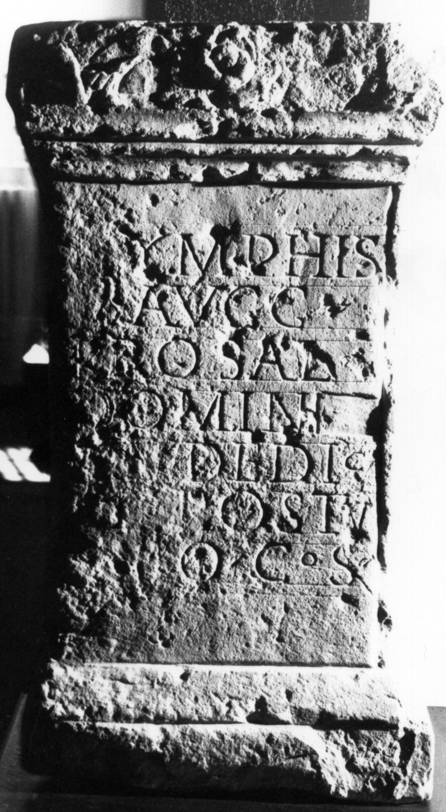

# EDH HD014013. Surduc

**Країна.** Румунія

**Провінція (код EDH).** Dac

**Сучасна назва.** Surduc

**Деталі знахідки.** {Tihău}

**Координати.** 47.2272,23.329600000

**Зберігання.** Zalău, Muz. Ist. Artă

**Датування (роки, від'ємні до н. е.).** 211 … 

**Тип пам'ятки.** Altar

**Розміри (висота, ширина, глибина, см).** 73.0 × 40.0 × 25.0

## Текст (латинь, скорочення розкрито)

```
[N]ymphis / Augg(ustis) / pro sal(ute) / domin[[n(orum)]] / [n[n(ostrorum)]] dedic(ante) / [F]l(avio) / Postu/mo co(n)s(ulari)
```

## Текст у вихідному записі

```
[ ]YMPHIS / AVGG / PRO SAL / DOMIN[[N]] / [[N]] DEDIC / [ ]L / POSTV / MO COS
```

## Коментар

Zeilenlinien für die Beschriftung. (B): Petolescu; AE 1977; Piso; AE 1978; Gudea - Lucăcel; ILD: abweichende Textwiedergabe.

## Література

AE 1978, 0678. (B)
- AE 1977, 0666. (B)
- ILD 761. (B)
- I. Piso, ActaMusNapoca 15, 1978, 183-184, Nr. 3; fig. 5; fig. 6 (Zeichnung). (B) - AE 1978.
- C.C. Petolescu, in: D.M. Pippidi - E. Popescu (Hrsg.), Epigraphica. Travaux dédiés au VIIe Congrès d'Épigraphie Grecque et Latine (Constantza 1977) 159-162; fig. 1. (B) - AE 1977.
- PIR (2. Aufl.) F 341.
- N. Gudea - V. Lucăcel, Inscripţii şi monumente sculpturale în Muzeul de Istorie şi Artă Zalău (Zalău 1975) 27, Nr. 55; Foto. (B) #

## Фото



Джерело https://edh.ub.uni-heidelberg.de/edh/inschrift/HD014013, ліцензія CC BY-SA 4.0. Оригінальний XML в архіві сирі_дані/edh_xml.zip
