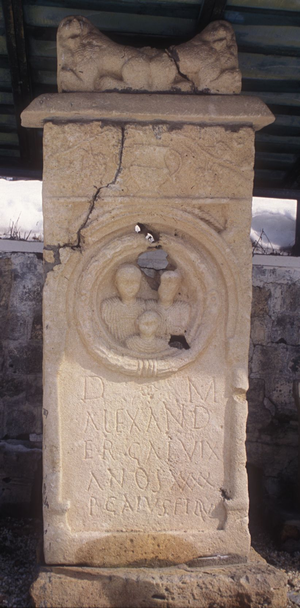

# EDH HD014016. Alburnus Maior

**Країна.** Румунія

**Провінція (код EDH).** Dac

**Місце знахідки (антична назва).** Alburnus Maior

**Сучасна назва.** Roşia Montană

**Деталі знахідки.** {Tăul Secuilor, bei, Nekropole}

**Координати.** 46.305519756,23.102853298

**Рік знахідки.** 1976

**Зберігання.** Roşia Montană, Muzeul

**Датування (роки, від'ємні до н. е.).** 171 … 200

**Матеріал.** Tuff

**Тип пам'ятки.** Stele

**Розміри (висота, ширина, глибина, см).** 204.0 × 95.0 × 21.0

## Текст (латинь, скорочення розкрито)

```
D(is) M(anibus) / Alexand/er Gai vix(it) / an(n)os XXXX / p(osuit) Gaius filius
```

## Текст у вихідному записі

```
D M / ALEXAND / ER GAI VIX / ANOS XXXX / P GAIVS FILIVS
```

## Коментар

Oberhalb der Inschrift Kranz mit den Büsten eines Mannes, einer Frau und eines Kindes. Hedera in Z. 1. (B): Moga - Manta; AE 1978; IDR III: Z. 5: Caius.

## Література

AE 1978, 0679. (B)
- V. Moga - V. Manta, StCercIstorV 29, 1978, 437-440; fig. 1. (B) - AE 1978.
- IDR 3, 3, 412; fig. 303. (B)
- C. Ciongradi, Die römischen Steindenkmäler aus Alburnus Maior (Cluj-Napoca 2009) 92-93, Nr. 117; Taf. 50, 117. #

## Фото



Джерело https://edh.ub.uni-heidelberg.de/edh/inschrift/HD014016, ліцензія CC BY-SA 4.0. Оригінальний XML в архіві сирі_дані/edh_xml.zip
