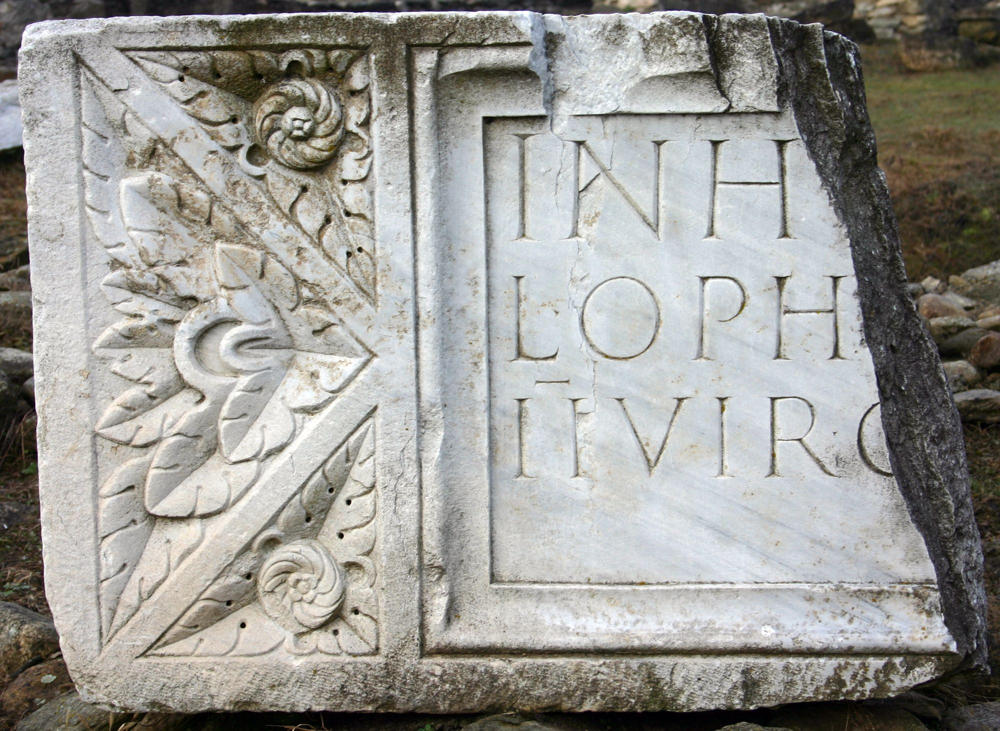

# EDH HD014657. Colonia Ulpia Traiana Sarmizegetusa

**Країна.** Румунія

**Провінція (код EDH).** Dac

**Місце знахідки (антична назва).** Colonia Ulpia Traiana Sarmizegetusa

**Сучасна назва.** Sarmizegetusa

**Деталі знахідки.** Forum Vetus, {östliches Nymphäum}

**Координати.** 45.513692575,22.787801027

**Зберігання.** Sarmizegetusa, Muz. Arh.; Deva, Muz. Civil. Dac. şi Rom.; Lugoj, Muz. Ist. Etnogr. Arta

**Датування (роки, від'ємні до н. е.).** 193 … 211

**Тип пам'ятки.** Tafel

**Розміри (висота, ширина, глибина, см).** 78.0 × 350.0 × 30.0

## Текст (латинь, скорочення розкрито)

```
In honorem domus divinae / L(ucius) Ophonius Pap(iria) Domitius Priscus / IIvir col(oniae) Dacic(ae) pecunia sua fecit / l(ocus) d(atus) d(ecreto) d(ecurionum)
```

## Текст у вихідному записі

```
IN HONOREM DOMVS DIVINAE / L OPHONIVS PAP DOMITIVS PRISCVS / IIVIR COL DACIC PECVNIA SVA FECIT / L D D D
```

## Коментар

Tabula ansata; in drei Fragmente gebrochen.

## Література

AE 1968, 0441.
- AE 1976, 0560.
- IDR 3, 2, 022; fig. 18 (Fotos u. Zeichnung).
- AE 2003, 1520.
- I.I. Russu, StudClas 9, 1967, 211-218; Fig. 1 u. Fig. 2; Fig. 3 (Zeichnung). - AE 1968.
- H. Daicoviciu, Tibiscus 3, 1974, 103-104. - AE 1976.
- R. Étienne - I. Piso - A. Diaconescu, ActaMusNapoca 39/40, 2002/03, 126, Anm. 110; pl. 40, 25 u. pl. 41 (Zeichnungen). - AE 2003.
- I. Piso, in: I. Piso (Hrsg.), Le forum vetus de Sarmizegetusa 1 (Bucureşti 2006) 243-246, Nr. 25; Fig. 3, 23 (Foto u. Zeichnung). #

## Фото



Джерело https://edh.ub.uni-heidelberg.de/edh/inschrift/HD014657, ліцензія CC BY-SA 4.0. Оригінальний XML в архіві сирі_дані/edh_xml.zip
