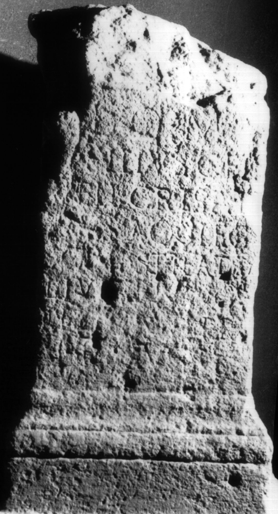

# EDH HD014875. Apulum

**Країна.** Румунія

**Провінція (код EDH).** Dac

**Місце знахідки (антична назва).** Apulum

**Сучасна назва.** Alba Iulia

**Деталі знахідки.** Subcetate, {Strada Octavian Goga 11}

**Координати.** 46.066204005,23.577352133

**Рік знахідки.** 1929

**Зберігання.** Alba Iulia, Muz. Unirii

**Датування (роки, від'ємні до н. е.).** 153 … 156

**Матеріал.** Kalkstein

**Тип пам'ятки.** Altar?

**Розміри (висота, ширина, глибина, см).** -112.0 × 36.0 × 36.0

## Текст (латинь, скорочення розкрито)

```
I(ovi) O(ptimo) M(aximo) / [-] Silius C(ai) fil(ius) / Vell(ina) Crispi/[n]us Aq(uileia) |(centurio) leg(ionis) / XIII g(eminae) strator / L(uci) Iu[l]i Procu/li [l]eg(ati) Au[g(usti)] pr(o) / pr(aetore) v(otum) s(olvit) l(ibens) m(erito)
```

## Текст у вихідному записі

```
I O M / [ ] SILIVS C FIL / VELL CRISPI / [ ]VS AQ | LEG / XIII G STRATOR / L IV[ ]I PROCV / LI [ ]EG AV[ ] PR / PR V S L M
```

## Коментар

Altar oder Statuenbasis. Oberer Teil nicht erhalten. (B): Gostar; AE 1967: Z. 4/5: Stell(atina) Crispi/nus Aq(uis).

## Література

AE 1967, 0385. (B)
- N. Gostar, AMold 4, 1966, 176-177; fig. 2 (Zeichnung). - AE 1967. (B)
- AE 1977, 0653.
- G. M. Forni, Apulum 13, 1975, 659-666; Foto. - AE 1977.
- D. Radu, Apulum 4, 1961, 99-100; Nr. 3; Zeichnung. - AE 1977.
- IDR 3, 5, 166; Foto u. Zeichnung. #

## Фото



Джерело https://edh.ub.uni-heidelberg.de/edh/inschrift/HD014875, ліцензія CC BY-SA 4.0. Оригінальний XML в архіві сирі_дані/edh_xml.zip
