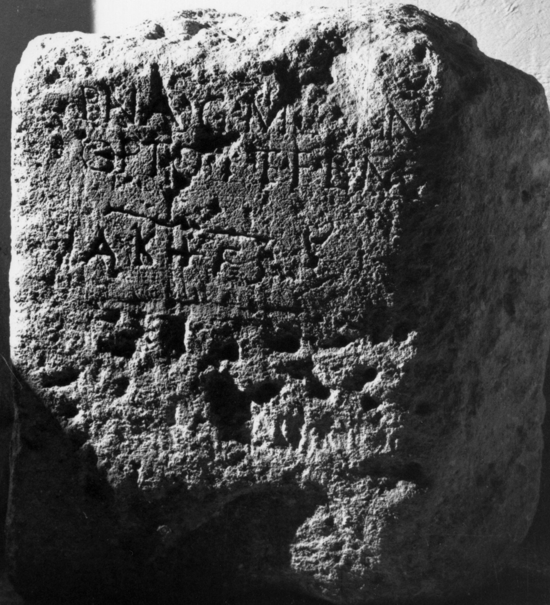

# EDH HD014902. Tibiscum

**Країна.** Румунія

**Провінція (код EDH).** Dac

**Місце знахідки (антична назва).** Tibiscum

**Сучасна назва.** Caransebeş

**Деталі знахідки.** Jupa, {Lager/Vicus}?

**Координати.** 45.467256057,22.188002548

**Зберігання.** Lugoj, Muz. Ist. Etnogr. Arta

**Датування (роки, від'ємні до н. е.).** 151 … 270

**Тип пам'ятки.** Stele?

**Розміри (висота, ширина, глибина, см).** -65.0 × 55.0 × 20.0

## Текст (латинь, скорочення розкрито)

```
$] / Bana G(aius) MA(?)E(?)[-]I(?)N / opt(i)o p(atri?) et f(ilio?) b(ene) m(erentibus?) / AKHFS
```

## Текст у вихідному записі

```
] / BANA G MAE[ ]IN / OPTO P ET F B M / AKHFS
```

## Коментар

Zeilenlinien für die Beschriftung außer in Z. 3. Z. 3: Reste unregelmäßiger gesetzter Buchstaben. (B): Gostar; AE 1967: Lesung abweichend / unvollständig.

## Література

AE 1967, 0394. (B)
- IDR 3, 1, 162; fig. 130 (Foto u. Zeichnung).
- N. Gostar, AMold 2/3, 1964, 301-305, Nr. 2; fig. 2 (Zeichnung). (B). - AE 1967. #

## Фото



Джерело https://edh.ub.uni-heidelberg.de/edh/inschrift/HD014902, ліцензія CC BY-SA 4.0. Оригінальний XML в архіві сирі_дані/edh_xml.zip
