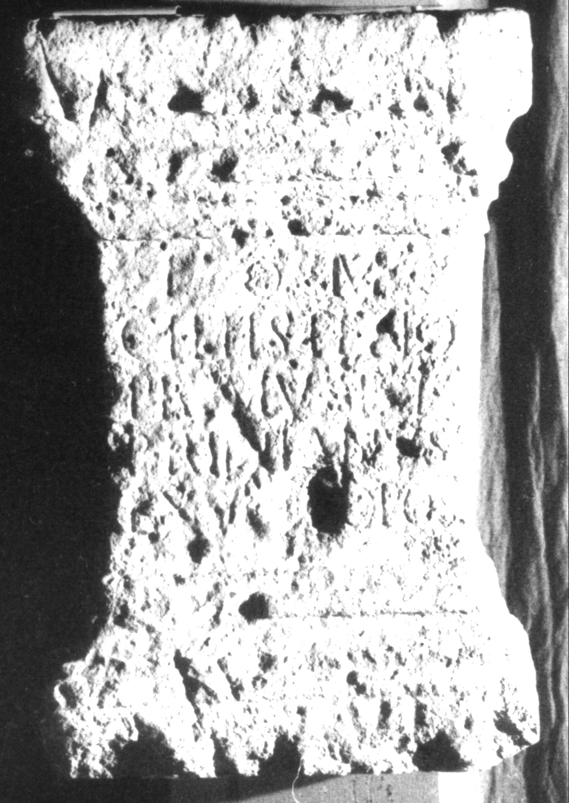

# EDH HD016021. Apulum

**Країна.** Румунія

**Провінція (код EDH).** Dac

**Місце знахідки (антична назва).** Apulum

**Сучасна назва.** Alba Iulia

**Деталі знахідки.** {Dealul Furcilor}

**Координати.** 46.058141585,23.569107006

**Зберігання.** Alba Iulia, Muz. Unirii

**Датування (роки, від'ємні до н. е.).** 151 … 270

**Матеріал.** Kalkstein

**Тип пам'ятки.** Altar?

**Розміри (висота, ширина, глибина, см).** 80.0 × 51.0 × 38.0

## Текст (латинь, скорочення розкрито)

```
I(ovi) O(ptimo) M(aximo) / Cimisteno / Primus et / Primianus / ex v[ot]o pos(uerunt)
```

## Текст у вихідному записі

```
I O M / CIMISTENO / PRIMVS ET / PRIMIANVS / EX V[ ]O POS
```

## Коментар

Altar oder Statuenbasis; Inschriftfeld ziemlich verwittert. Fundstelle liegt im Bereich des municipium Septimium.

## Література

AE 1964, 0185.
- I. Berciu - A. Popa, Latomus 22, 1963, 69, Nr. 1; pl. 12, fig. 1a-b (Foto und Zeichnung). - AE 1964.
- IDR 3, 5, 209; Foto u. Zeichnung. #

## Фото



Джерело https://edh.ub.uni-heidelberg.de/edh/inschrift/HD016021, ліцензія CC BY-SA 4.0. Оригінальний XML в архіві сирі_дані/edh_xml.zip
