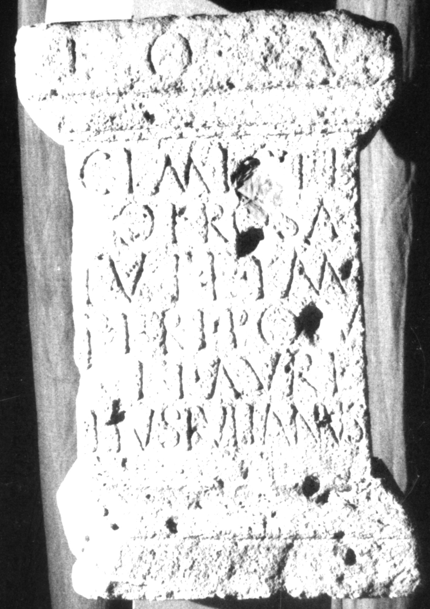

# EDH HD016024. Apulum

**Країна.** Румунія

**Провінція (код EDH).** Dac

**Місце знахідки (антична назва).** Apulum

**Сучасна назва.** Alba Iulia

**Деталі знахідки.** {Dealul Furcilor}

**Координати.** 46.058141585,23.569107006

**Зберігання.** Alba Iulia, Muz. Unirii

**Датування (роки, від'ємні до н. е.).** 171 … 270

**Матеріал.** Kalkstein

**Тип пам'ятки.** Altar

**Розміри (висота, ширина, глибина, см).** 82.0 × 35.0 × 37.0

## Текст (латинь, скорочення розкрито)

```
I(ovi) O(ptimo) M(aximo) / Cimiste/[n]o pro sa/lute imperi po[s]u/it Aure/lius Iulianus
```

## Текст у вихідному записі

```
I O M / CIMISTE / [ ]O PRO SA / LVTE IMPERI PO[ ]V / IT AVRE / LIVS IVLIANVS
```

## Коментар

Die Fundstelle liegt im Bereich des municipium Septimium.

## Література

AE 1964, 0186.
- I. Berciu - A. Popa, Latomus 22, 1963, 69-71, Nr. 2; pl. 13, fig. 2a; fig. 2b (Zeichnung). - AE 1964.
- IDR 3, 5, 208. #

## Фото



Джерело https://edh.ub.uni-heidelberg.de/edh/inschrift/HD016024, ліцензія CC BY-SA 4.0. Оригінальний XML в архіві сирі_дані/edh_xml.zip
