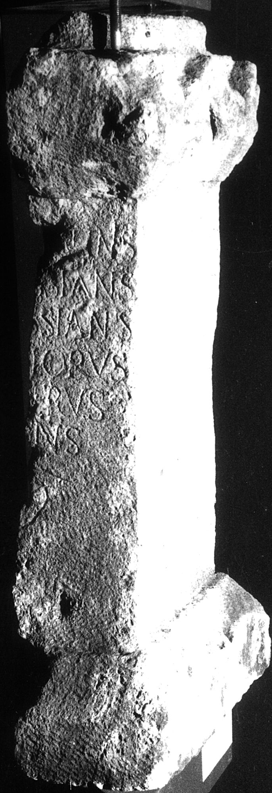
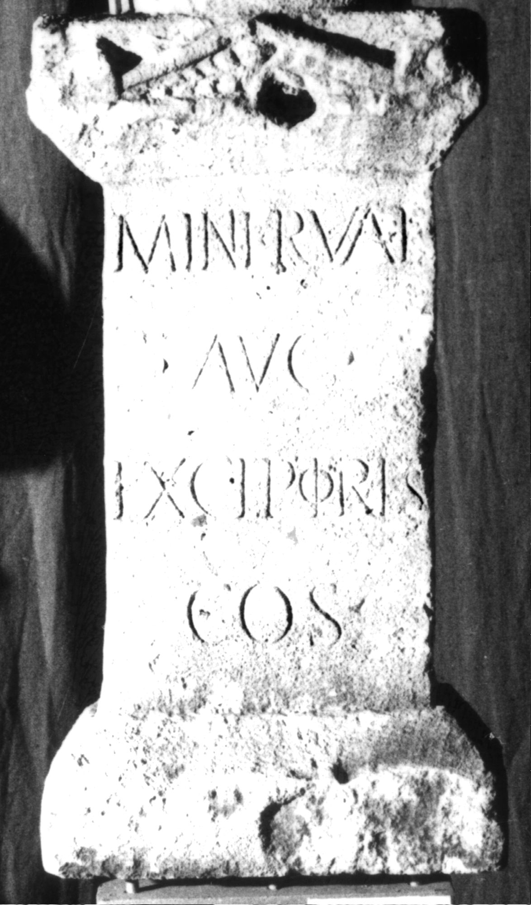

# EDH HD016045. Apulum

**Країна.** Румунія

**Провінція (код EDH).** Dac

**Місце знахідки (антична назва).** Apulum

**Сучасна назва.** Alba Iulia

**Деталі знахідки.** Subcetate, {Strada Octavian Goga 11}

**Координати.** 46.066204005,23.577352133

**Рік знахідки.** 1962

**Зберігання.** Alba Iulia, Muz. Unirii

**Датування (роки, від'ємні до н. е.).** 168 … 270

**Матеріал.** Kalkstein

**Тип пам'ятки.** Altar

**Розміри (висота, ширина, глибина, см).** 77.0 × 40.0 × -18.0

## Текст (латинь, скорочення розкрито)

```
Minervae / Aug(ustae) / exceptores / co(n)s(ularis) // [---]tinus / [---]ssianus / [---]ssianus / [--- F]lorus / [--- Sev?]erus / [--- Vale?]ns / [------]
```

## Текст у вихідному записі

```
MINERVAE / AVG / EXCEPTORES / COS / / [ ]TINVS / [ ]SSIANVS / [ ]SSIANVS / [ ]LORVS / [ ]ERVS / [ ]NS / [ ]
```

## Коментар

Inschrift verteilt sich auf Vorder- und linke Nebenseite des Altars. Nebenseite: Z. 7 (Ende): hedera. IDR 3, 5: auch [Ca]ssianus möglich. Z. 7 (Ende): hedera. (B): Berciu - Popa, Latomus; Berciu - Popa, Apulum; AE 1964; AE 1965: Abweichungen in der Lesung.

## Література

AE 1964, 0193. (B)
- AE 1965, p. 11 s. n. 30. (B)
- IDR 3, 5, 263; Foto u. Zeichnung.
- I. Berciu - A. Popa, Latomus 23, 1964, 302-310; pl. 21, 1 u. 22, 2 (Fotos u. Zeichnungen). (B) - AE 1964. 1965.
- I. Berciu - A. Popa, Apulum 5, 1965, 180-187, Nr. 4; fig. 4 u. 5. (B) - AE 1965. #

## Фото





Джерело https://edh.ub.uni-heidelberg.de/edh/inschrift/HD016045, ліцензія CC BY-SA 4.0. Оригінальний XML в архіві сирі_дані/edh_xml.zip
