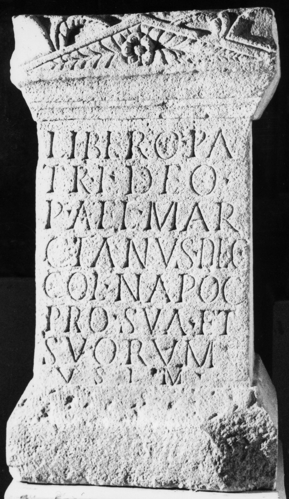

# EDH HD016157. Napoca

**Країна.** Румунія

**Провінція (код EDH).** Dac

**Місце знахідки (антична назва).** Napoca

**Сучасна назва.** Cluj-Napoca

**Координати.** 46.771741,23.576094000

**Зберігання.** Cluj-Napoca, Muz. Naţ. Ist. Transilv.

**Датування (роки, від'ємні до н. е.).** 161 … 250

**Тип пам'ятки.** Altar

**Розміри (висота, ширина, глибина, см).** 75.0 × 40.0 × 34.0

## Текст (латинь, скорочення розкрито)

```
Libero Pa/tri deo / P(ublius) Ael(ius) Mar/cianus dec(urio) / col(oniae) Napoc(ensium) / pro sua et / suorum / v(otum) s(olvit) l(ibens) m(erito)
```

## Текст у вихідному записі

```
LIBERO PA / TRI DEO / P AEL MAR / CIANVS DEC / COL NAPOC / PRO SVA ET / SVORVM / V S L M
```

## Коментар

(B): AE 1966: Z. 6: pro sua salute et; ""salute"" ist zwar gemeint, aber nicht in den Stein eingemeißelt.

## Література

AE 1966, 0310. (B)
- A. Bodor, Dacia 7, 1963, 224; Abb. 8. - AE 1966.
- ILD 547.
- Á. Szabó, AAntHung 39, 1999, 356; Abb. 4. #

## Фото



Джерело https://edh.ub.uni-heidelberg.de/edh/inschrift/HD016157, ліцензія CC BY-SA 4.0. Оригінальний XML в архіві сирі_дані/edh_xml.zip
