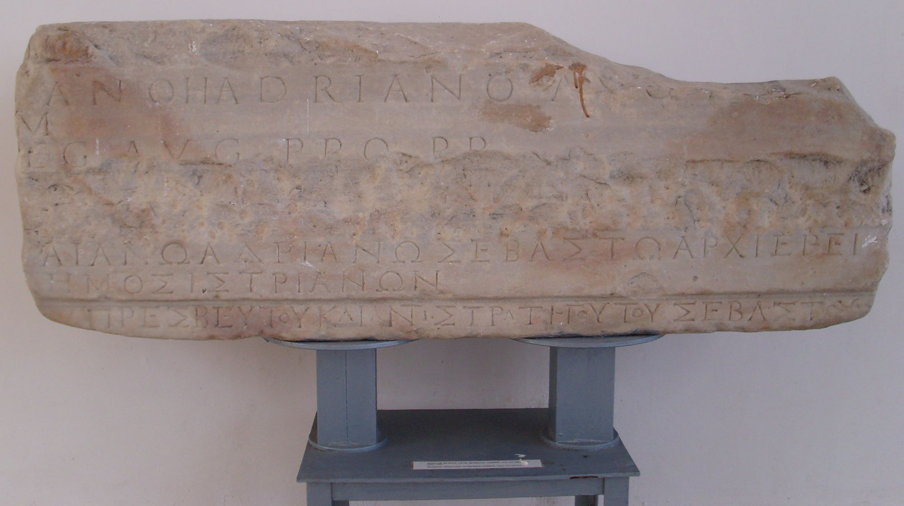
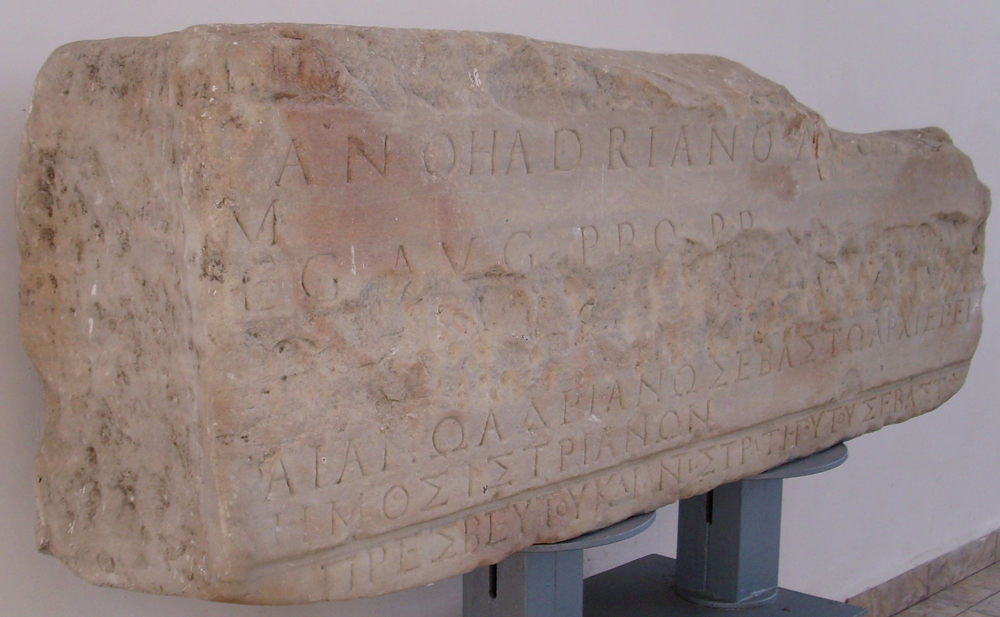

# EDH HD016292. Istrus

**Країна.** Румунія

**Провінція (код EDH).** MoI

**Місце знахідки (антична назва).** Istrus

**Сучасна назва.** Istria

**Деталі знахідки.** {spätantike Festung}, südlich, Sinoe-See, bei

**Координати.** 44.547603664,28.774909972

**Зберігання.** Istria, Muzeul

**Датування (роки, від'ємні до н. е.).** 117 … 128

**Тип пам'ятки.** Architekturteil

**Розміри (висота, ширина, глибина, см).** 52.0 × -143.0 × 34.0

## Текст (латинь, скорочення розкрито)

```
[Imperatori Caesari Tra]iano Hadriano Aug[usto] / [p(ontifici)] m(aximo) / [--- l]eg(ato) Aug(usti) pr(o) pr(aetore) / [Histrianorum civitas] // [Αὐτοκράτορι Καίσαρι Τρ]αιανῷ Ἁδριανῷ Σεβαστῷ ἀρχιερεῖ [μεγίστῳ] / [βουλὴ] δῆμος Ἰστριανῶν / [προνοησαμένου? ---] πρεσβευτοῦ καὶ ἀντιστρατήγου τοῦ Σεβαστοῦ
```

## Текст у вихідному записі

```
[ ]IANO HADRIANO AVG[ ] / [ ] M / [ ]EG AVG PR PR / [ ] / / [ ]ΑΙΑΝΩ ΑΔΡΙΑΝΩ ΣΕΒΑΣΤΩ ΑΡΧΙΕΡΕΙ [ ] / [ ] ΔΗΜΟΣ ΙΣΤΡΙΑΝΩΝ / [ ] ΠΡΕΣΒΕΥΤΟΥ ΚΑΙ ΑΝΤΙΣΤΡΑΤΗΓΟΥ ΤΟΥ ΣΕΒΑΣΤΟΥ
```

## Коментар

Architrav. (B): Am Anfang der Z. 7 wird [προνοησαμένου? - - -] in IScM 1, 148 mit Verweis auf ähnliche Wendungen in IScM 1, 149 u. 150 vorgeschlagen.

## Література

AE 1966, 0358. (B)
- D.M. Pippidi, in: L. Bernhard (Hrsg.), Mélanges offerts à Kazimierz Michalowski (Warszawa 1966) 613-623; Foto. - AE 1966.
- IScM 1, 148. (B)
- SEG 25, 0791. (B)
- A. Avram, Dacia 51, 2007, 100. #

## Фото





Джерело https://edh.ub.uni-heidelberg.de/edh/inschrift/HD016292, ліцензія CC BY-SA 4.0. Оригінальний XML в архіві сирі_дані/edh_xml.zip
