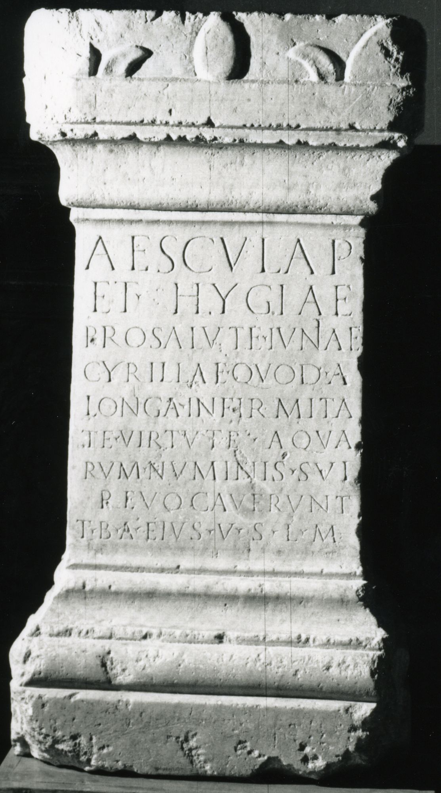

# EDH HD016840. Ad Mediam, bei

**Країна.** Румунія

**Провінція (код EDH).** Dac

**Місце знахідки (антична назва).** Ad Mediam, bei

**Сучасна назва.** Băile Herculane

**Деталі знахідки.** Badeanlagen, sekundär verwendet

**Координати.** 44.8786111,22.414166700

**Зберігання.** Băile Herculane, Muz. Ist.

**Датування (роки, від'ємні до н. е.).** 101 … 150

**Тип пам'ятки.** Altar

**Розміри (висота, ширина, глибина, см).** 73.0 × 37.0 × 30.0

## Текст (латинь, скорочення розкрито)

```
Aesculap(io) / et Hygiae / pro salute Iuniae / Cyrillae quod a / longa infirmita/te virtute aqua/rum numinis sui / revocaverunt / T(itus) B(---) A(---) eius v(otum) s(olvit) l(ibens) m(erito)
```

## Текст у вихідному записі

```
AESCVLAP / ET HYGIAE / PRO SALVTE IVNIAE / CYRILLAE QVOD A / LONGA INFIRMITA / TE VIRTVTE AQVA / RVM NVMINIS SVI / REVOCAVERVNT / T B A EIVS V S L M
```

## Література

AE 1962, 0233.
- CIL 03, 01561.
- IDR 3, 1, 055; fig. 48 (Foto u. Zeichnung).
- J.F. Killeen, Glotta 38, 1960, 309. - AE 1962. #

## Фото



Джерело https://edh.ub.uni-heidelberg.de/edh/inschrift/HD016840, ліцензія CC BY-SA 4.0. Оригінальний XML в архіві сирі_дані/edh_xml.zip
